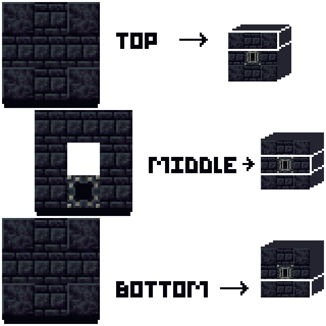

# Clibano

The clibano is a powerful upgrade to the Blast Furnace that allows faster smelting as well as creating new alloys.&#x20;

## <mark style="color:purple;">Setup</mark>

The clibano is build out of Darkstone. You need the following materials to get started:

* 18 Polished Darkstone Bricks
* 8 Polished Darkstone
* 1 Clibano Core
* 1 Mundabitur Dust

<figure><figcaption>
Place the blocks in this pattern. The center block needs to be air.
</figcaption></figure>

To transform the structure into the actual clibano you'll need to use your Mundabitur Dust on the Clibano Core block.

### <mark style="color:purple;">Usage</mark>

The clibano can be used the same way as a Blast Furnace. However, since it has two input slots you may smelt two items at the same time.&#x20;

On the left side of the interface you'll notice an Enhnacer Slot. If you place an Artisan Relic here you can use the alloy smelting mode of the clibano. In this mode you can smelt two items into one result. \
The first alloy you'll want to make is the Obsidiansteel Ingot. It's the result of the combination of Obsidian with Raw Iron.

### <mark style="color:purple;">Fire Types</mark>

By default the clibano will smelt with normal fire. However, there are two other fire types that provide additional benefits.

Soul Fire increases the smelting speed by the factor 1.5x. In order to smelt with soul fire you have to input either a Soul or Dark Soul into the slot.

Enchanted Fire is created when burning Enchanted Souls and increases your smelting speed by 2.5x.&#x20;

### <mark style="color:purple;">Residues</mark>

When you smelt with Soul Fire or Enchanted Fire there is a chance that each smolten item creates a small amount of residue. You can see the currently stored residues in the clibano in the bar that's located beneath the output slot.\
Once a few residues have accumulated they will turn into an additional output item. For example, nine iron residues will form a whole Iron Block for you.

The residue system can be seen as a form of ore doubling.
