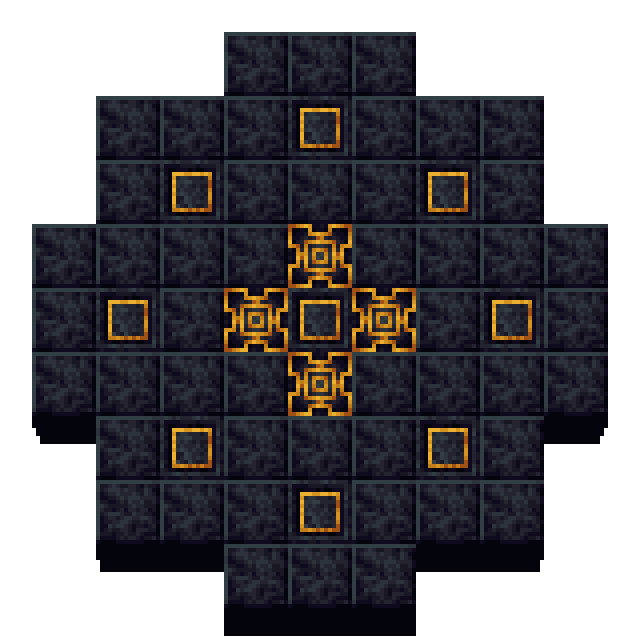
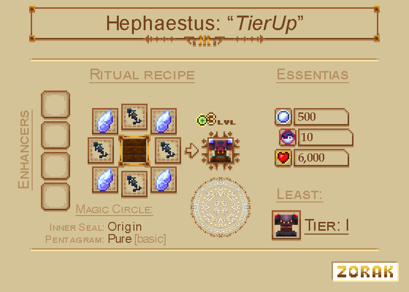
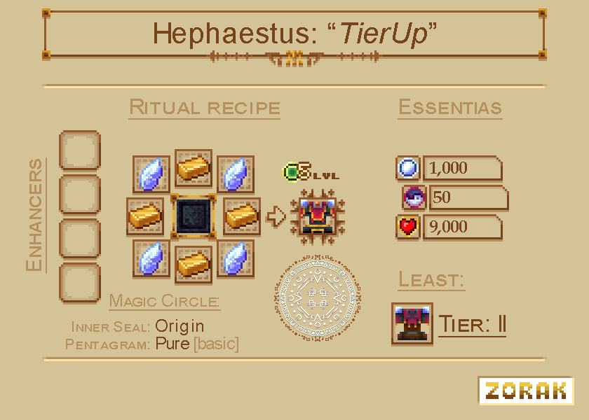
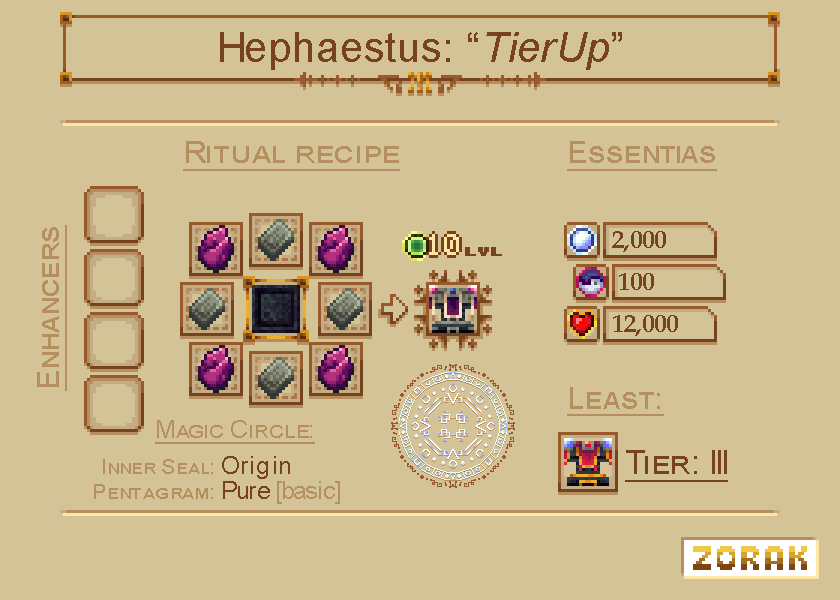
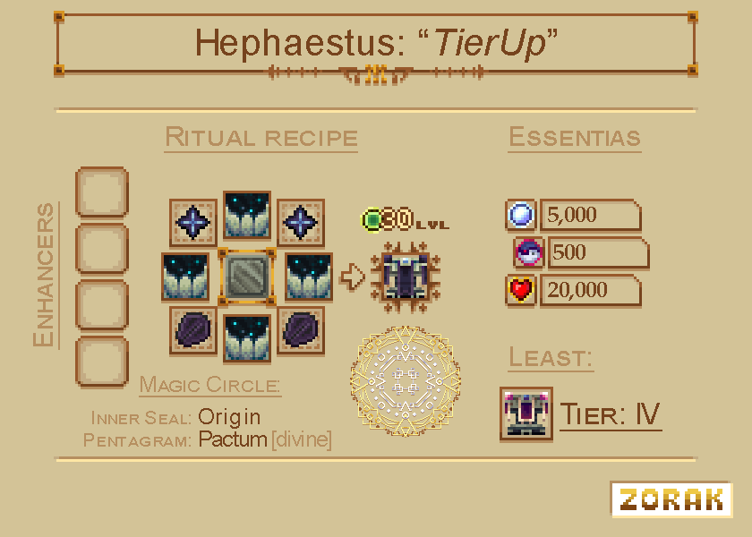

# Hephaestus Forge

The Hephaestus Forge is needed for every player that wants to dive deep into the world of forbidden magic. Gathering the required material for creating it might take a while, but it's worth the effort as it will open up the possibility of executing powerful rituals which can have various outcomes.&#x20;

## <mark style="color:purple;">Setup</mark>

To get started you will have to obtain the following materials:&#x20;

* 48 Polished Darkstone
* 9 Gilded Chiseled Polished Darkstone
* 4 Chiseled Arcane Polished Darkstone
* 1 Mundabitur Dust
* 1 Smithing Table

<figure><figcaption>
In the first step you'll need to build a pattern like this which will serve as the base for the Hephaestus Forge.
</figcaption></figure>

After having built the above pattern, place the Smithing Table in the central spot above the Gilded Chiseled Polished Darkstone block. In order to transform it into the desired Hephaestus Forge you'll now only need to sneak and right-click with the Mundabitur Dust on the Smithing Table. A bolt of corrupted lightning will strike the block and transform it.&#x20;

**Congrats, you've successfully created your Hephaestus Forge!**

## <mark style="color:purple;">Essences</mark>

Now that you've set up your Hephaestus Forge a new menu will welcome you.

<figure><figcaption>
The menu of the Hephaestus Forge.
</figcaption></figure>

It might look a bit overwhelming at first, but it's very straightforward once you get used to it. Each ritual has one main ingredient that goes into the big slot in the middle. The four slots surrounding it can be used for enhancers. Some enhancers are required to start certain rituals while many enhancers are optional and provide useful advantages such as reduced essence costs.&#x20;


See [enhancer-relics.md](../../../items/enhancer-relics.md "mention") for explanations of the different available Enhancers.


You might have noticed that the menu contains 4 different bars. These all represent a different essence type. To fill these bars, you can use the slots on the side of the screen.&#x20;

The four essence types are:

* Aureal
* Souls
* Blood
* Experience

Each ritual requires a different set of essences to start.


A list of all ways to gain essences can be found here: [essence-providers.md](../../../blocks/hephaestus-forge/essence-providers.md "mention")


## <mark style="color:purple;">Pedestals</mark>

Every ritual you execute will require you to sacrifice certain items which need to be placed on Pedestals. Obtaining these Pedestals should be your next step. Most rituals will only need 6 Pedestals while others may require you to use all 8 available spots for Pedestals.&#x20;

Currently Forbidden & Arcanus has two types of Pedestals - the normal Darkstone Pedestal and the Magnetized Darkstone Pedestal.&#x20;

<figure><figcaption>
The two different Pedestal types.
</figcaption></figure>

When just starting your journey, you'll want to go with the default Darkstone Pedestals for now. You can later turn them into their Magnetized variant by using a Ferrognetic Mixture created through a ritual on them. Magnetized Darkstone Pedestals have the advantage that they automatically display items thrown upon them - this unique property can for example be used to partially automate rituals.&#x20;

## <mark style="color:purple;">Starting a ritual</mark>

After placing all required items on the pedestals and filling the essence bars to the needed amount, you might start the desired ritual. In order to do this, you'll simply have to craft a [Blacksmith Gavel ](../../../items/#blacksmith-gavel)and right-click the Hephaestus Forge with it.

After 25 seconds the ritual has been completed.&#x20;

## <mark style="color:purple;">Upgrading your Forge</mark>

The Hephaestus Forge comes in 5 different tiers. When you first create it, it will be tier 1 which is enough for simple rituals but won't suffice for executing more advanced rituals. Upgrading your Forge tier will allow you to store a larger number of essences in the Hephaestus Forge and thus allow you to execute new rituals.

The upgrading needs to be started with special upgrading rituals. Unlike default rituals, these won't create a result item, but advance your Hephaestus Forge by one tier after they have been completed. Below you can find the instructions for these special rituals.

### Tier 2

<figure><figcaption></figcaption></figure>

### Tier 3

<figure><figcaption></figcaption></figure>

### Tier 4

<figure><figcaption></figcaption></figure>

### Tier 5

<figure><figcaption></figcaption></figure>

##

