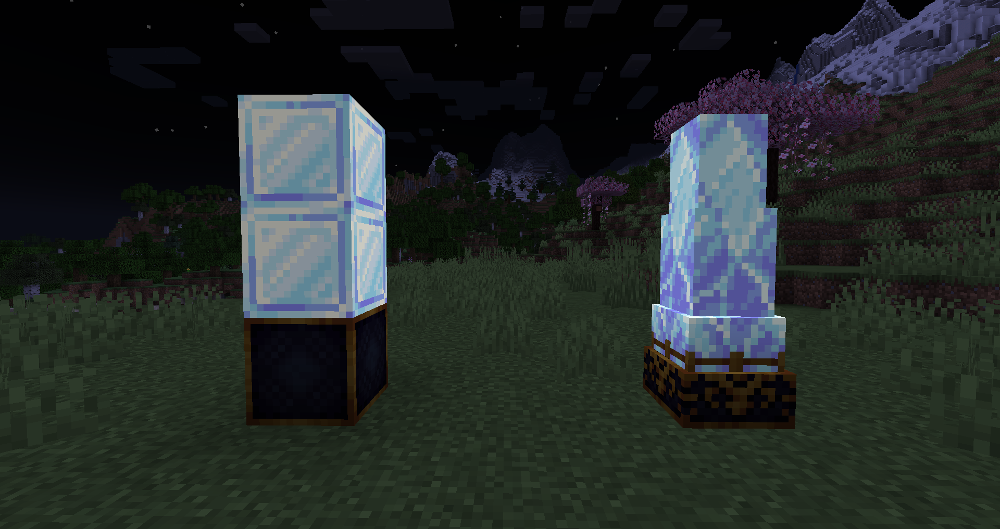

# Essence Providers

## <mark style="color:purple;">Aureal</mark>

If you want to use items to provide the needed Aureal you'll need to use normal Aureal Bottles or their Splash variant.

<table><thead><tr><th width="475">Item</th><th>Amount</th></tr></thead><tbody><tr><td> Aureal Bottle</td><td>35</td></tr><tr><td> Splash Aureal Bottle</td><td>30</td></tr></tbody></table>

Alternatively, the Aureal production can be automated using Arcane Crystal Obelisks.&#x20;

### <mark style="color:purple;">Arcane Crystal Obelisk</mark>&#x20;

Gathering the required essences for a ritual can be tedious - luckily Aureal can be automated with the help of Obelisks. When placed in one of the spots where normally a Pedestal would go, it will slowly fill up the Aureal bar in the Hephaestus Forge.&#x20;

In order to create an Obelisk you'll have to place 2 Arcane Crystal Blocks on top of an Arcane Polished Darkstone Block. To complete the transformation, you'll have to once again use Mundabitur Dust.&#x20;

<figure><figcaption>
Left: the structure before the transformation. Right: the finished Arcane Crystal Obelisk.
</figcaption></figure>

## <mark style="color:purple;">Souls</mark>

There are currently two ways to acquire souls:

1. &#x20;Suck the Souls out of their beloved Sand with the Soul Extractor and turn Soul Sand into Soulless Sand.
2. &#x20;In your world, you may occasionally run across the path of a Lost Soul. These poor little fellows got lost and now wander aimlessly through the world. They are pretty adorable and get easily scared. Killing them grants you a Soul item.\
   \
   You don't want to rely on finding Lost Souls randomly in your world? Luckily there's a solution - simply enchant your sword with the Soul Looting enchantment. Each level grants a 5% chance to summon a Lost Soul when you kill an entity.\
   \
   Lost Souls come in three different variations: the default white ones, the blue Corrupt Lost Souls, and the pinkish Enchanted Lost Souls.&#x20;

<table><thead><tr><th width="475">Item</th><th>Amount</th></tr></thead><tbody><tr><td> Soul</td><td>1</td></tr><tr><td> Corrupt Soul</td><td>1</td></tr><tr><td> Enchanted Soul</td><td>10</td></tr></tbody></table>

## <mark style="color:purple;">Blood</mark>

For this essence you'll need to get your fingers dirty and sacrifice entities.&#x20;

Either directly hurt entities near the forge and their blood will directly fill the essence bar or craft a Test Tube and place it in your offhand. In this case the blood of damaged entities will fill the Test Tube and you can later input it into the forge.

## <mark style="color:purple;">Experience</mark>

Gaining experience is usually pretty simple, but you'll now need it in item form now. If you didn't know, the Black Hole is perfect for this as it absorbs all experience orbs and spits out Xpetrified Orbs after a while.


A full explanation of the Black Hole can be found here: [#black-hole](../../../blocks/#black-hole "mention")


Alternatively, did you know that the Hephaestus Forge can also remove enchantments from your tools to gain experience? Simply put your tools in the experience slot and all enchantments on that item will be magically turned into experience to fill the bar.&#x20;

<table><thead><tr><th width="475">Item</th><th>Amount</th></tr></thead><tbody><tr><td> Xpetrified Orb</td><td>91</td></tr><tr><td> Experience Bottle (Bottle o' Enchanting)</td><td>15</td></tr></tbody></table>
