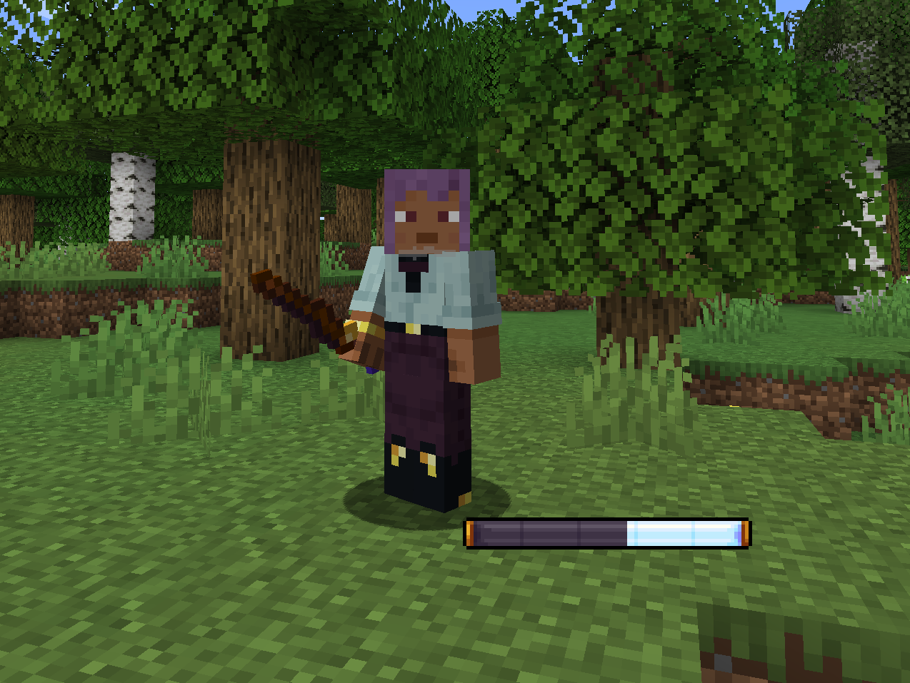

# Magic Wand

<figure><figcaption>
A player holding a Magic Wand
</figcaption></figure>

## Magic Wands

Magic Wands are special tools designed to cast spells. Currently, there is only one Magic Wand and one available spell, but future updates will introduce more spells.

### Usage

When holding a Magic Wand, two new UI elements appear:

1. **Aureal Bar:** Located above your hotbar, this bar displays your Aureal level, crucial for spell casting as each spell requires a specific Aureal cost.
2. **Magic Wand Indicator:** Replacing the default Attack Indicator above your crosshair, this shows the spell charging process. To cast a spell, simply hold right-click. The Indicator charges, and once full, release right-click to cast the spell. The charging duration varies for different spells.

## Spells

### Aureal Missile

The Aureal Missile is a simple yet powerful spell. Upon casting, it spawns an Aureal Projectile, dealing a total of 5 damage. This spell is economical, requiring only 5 Aureal to cast.

{% embed url="https://files.gitbook.com/v0/b/gitbook-x-prod.appspot.com/o/spaces%2F-MgQMa2lWfKGUl51wZg-%2Fuploads%2FhXQFeSzrxyRw3bMDM1Mu%2FUntitled%20video%20-%20Made%20with%20Clipchamp%20(3).mp4?alt=media&token=64601491-87fa-4c3b-9691-1a623105a30e" %}
