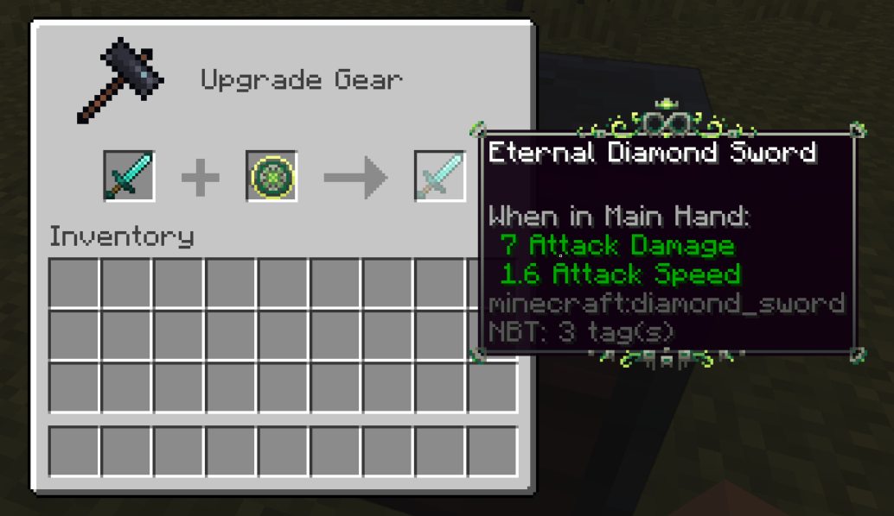
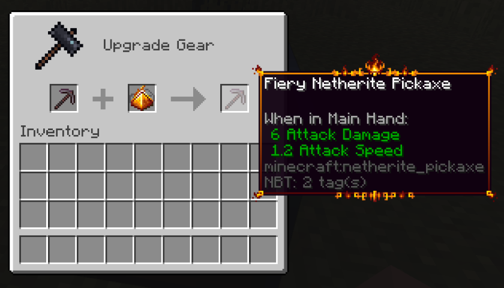
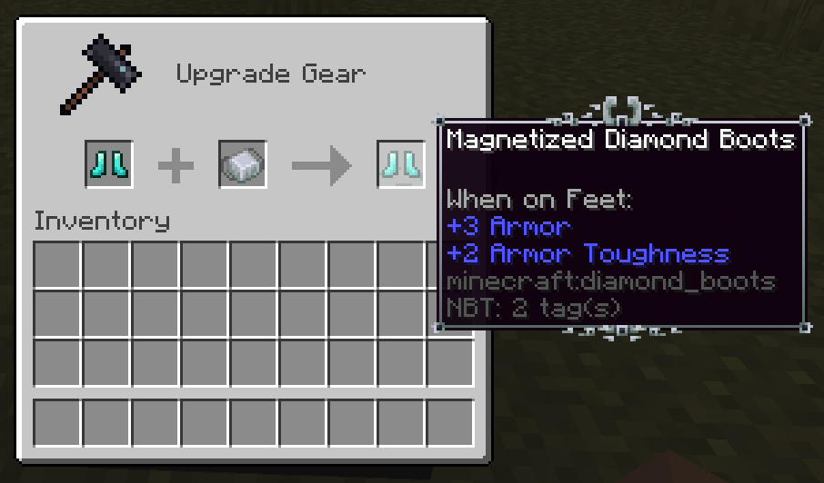
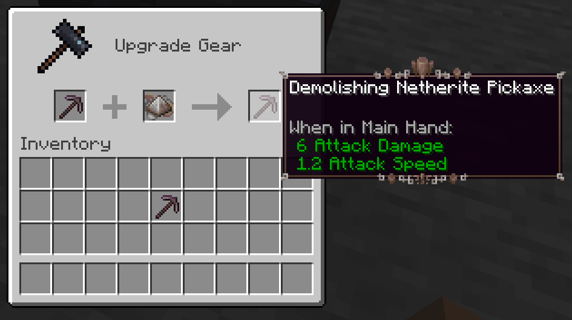

# Item Modifiers

Forbidden & Arcanus adds a new item modifier system in recent versions. Modifiers are special attributes attached to an item giving it new strong abilities. Be aware though that every item can only contain one modifier at a time, choose wisely!

The items that can be used to apply modifiers to items in the Smithing Table usually need to be forged in the [#hephaestus-forge](blocks/#hephaestus-forge "mention"). Items with an active modifier will have a unique tooltip border that resembles the container modifier.

## <mark style="color:purple;">Eternal modifier</mark>

The eternal modifier is probably the strongest of the currently implemented modifiers. However, the advantage of completely removing durability from an item and making it truly eternal comes with a high cost: the ritual that creates the [#eternal-stella](items/#eternal-stella "mention") item in the [#hephaestus-forge](blocks/#hephaestus-forge "mention") requires a Stellarite Piece as an ingredient.

The Eternal Stella is applicable to all items with a durability bar.

<figure><figcaption>
Applying the Eternal modifier to a Diamond Sword using an Eternal Stella.
</figcaption></figure>

## <mark style="color:purple;">Fiery modifier</mark>

The fiery modifier can be applied to all tool items (Pickaxes, Shovels, Axes, Hoes) and will automatically smelt all mined blocks if they have a smelting recipe.&#x20;

<figure><figcaption>
Applying the Fiery modifier to a Netherite Pickaxe using a Smelter Prism.
</figcaption></figure>

## <mark style="color:purple;">Magnetized modifier</mark>

The magnetized modifier can only be used on Boots. When boots with this modifier are equipped, the item pick-up range of the player will increase by one and a half blocks.

<figure><figcaption>
Applying the Magnetized modifier to Diamond Boots using a Ferrognetic Mixture.
</figcaption></figure>

## <mark style="color:purple;">Demolishing modifier</mark>

The demolishing modifier can unlock the true power out of your tools (Pickaxes, Shovels, Axes, Hoes). Tools with this modifier will be able to break a 3x3 area.

<figure><figcaption>
Applying the Demolishing modifier to a Netherite Pickaxe using a Terrastomp Prism.
</figcaption></figure>

New modifiers will be added in the future as updates are made. If you got a unique suggestion for a new modifier don't hesitate to tell us in our [Discord server](https://discord.com/invite/Bn2GyvE) and maybe your idea will become reality. :)&#x20;
