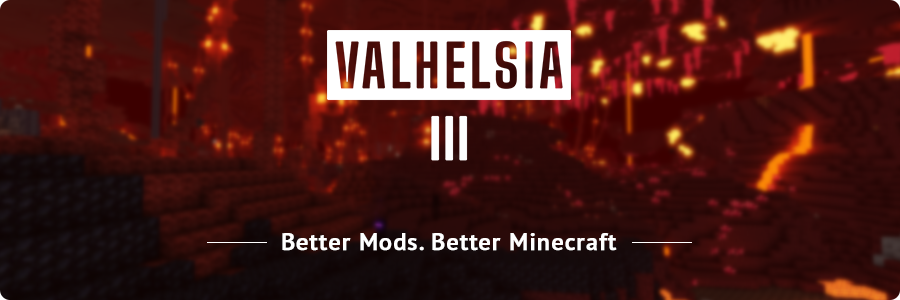

# Valhelsia 3

The Valhelsia Team is proud to present to you the third installment of the Valhelsia mod pack, this time for Minecraft 1.16! The pack includes many of the most popular classic mods to ensure that veteran modded players feel right at home, and we also include many amazing new mods to discover, keeping the pack fresh and full of new experiences just waiting to happen.

Valhelsia 3 offers something for every Minecraft player, no matter your play style. Builders will love the huge selection of gorgeous decorative blocks to expand the palette they can work with. Engineers and technical players have access to powerful automation and machinery. Adventurers will find plenty of structures to discover throughout the world, plentiful caves and underground dungeons, and even more when traveling into other dimensions. You might even find some rare artifacts!

While we aim to provide a pack that appeals to a broad range of players, we are also very selective about the quality of the mods that we include, resulting in a refined pack of the very best mods that the Minecraft 1.16 modding community has to offer.

| Information                                                                                                                                                                            |
| -------------------------------------------------------------------------------------------------------------------------------------------------------------------------------------- |
| 
<strong>Lead Project:</strong>

<a href="https://twitter.com/Khytwel">Khytwel</a> <strong>Contributor:</strong>

<a href="https://twitter.com/vaelzan">Vaelzan</a>
 |
| 
<strong>Release Date:</strong>

July 8, 2020
                                                                                                                               |
| 
<strong>Current Version:</strong> <a href="https://www.curseforge.com/minecraft/modpacks/valhelsia-3/files/3707295">3.5.1</a>
                                                |
| 
<strong>Minecraft:</strong>

1.16.5
                                                                                                                                        |
| 
<strong>Modloader:</strong>

Forge
                                                                                                                                         |


