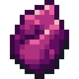

# Apotheosis

## <mark style="color:orange;">About Apotheosis</mark>

Apotheosis is a mod about improving the vanilla experience while attempting to stay true to the base game. It adds new potions, enchantments, dangers, mechanics, and other interesting things that greatly improve the Minecraft experience.

| Information                                                                                                                                                                                                                                                                                                  |
| ------------------------------------------------------------------------------------------------------------------------------------------------------------------------------------------------------------------------------------------------------------------------------------------------------------ |
| 
<strong>Author:</strong>

<a href="https://www.curseforge.com/members/shadows_of_fire/projects">Shadows_of_Fire</a>
                                                                                                                                                                              |
| 
<strong>Release Date:</strong>

February 13, 2019
                                                                                                                                                                                                                                                |
| 
<strong>Current Version:</strong>

<a href="https://www.curseforge.com/minecraft/mc-mods/apotheosis/files/3292606">1.16.5-4.5.2</a>
                                                                                                                                                              |
| 
<strong>Minecraft:</strong>

1.16, 1.15, 1.14
                                                                                                                                                                                                                                                    |
| 
<strong>Modloader:</strong>

Forge
                                                                                                                                                                                                                                                               |
| 
<strong>Included In:</strong>

<a href="https://www.curseforge.com/minecraft/modpacks/valhelsia-3">Valhelsia 3</a> <a href="https://www.curseforge.com/minecraft/modpacks/valhelsia-2">Valhelsia 2</a> <a href="https://www.curseforge.com/minecraft/modpacks/valhelsia-1">Valhelsia 1</a>
 |


Apotheosis will not be present on our next modpack after Valhelsia 3.&#x20;


## <mark style="color:orange;">About Apotheosis in Valhelsia 3</mark>

Apotheosis has been completely customized to integrate properly with Valhelsia 3. All the information you can find below is related to Valhelsia 3, moreover, the only module currently activated is the spawner module.

## <mark style="color:orange;">Spawner</mark>

In Apotheosis, Mob Spawners are not as simple as they seem. They can be collected with **Silk Touch**, for a price. Breaking a Mob Spawner with silk touch will drop the spawner and retain all of it's properties, but also deal 500 durability damage to the pickaxe used.

### Modifiers

Apotheosis introduces a system for modifying the stats of spawners. To use a spawner modifier, simply right click the item on the spawner, and if the modifier can be applied, the item will be consumed.

Here you will find all the modifiers applicable to the spawners.

| Name                     | Icon                                                                                   | Description                                                                                                                        | Stats                                                                     |
| ------------------------ | -------------------------------------------------------------------------------------- | ---------------------------------------------------------------------------------------------------------------------------------- | ------------------------------------------------------------------------- |
| Speed Upgrade            |             | Decreases maximum spawn delay.                                                                                                     | 
<strong>Min Value:</strong> 400 <strong>Max Value:</strong> 800
 |
| Ender Air Bottle         |          | Increases spawn count.                                                                                                             | 
<strong>Min Value:</strong> 1 <strong>Max Value:</strong> 8
     |
| Rune                     |                      | Increases max nearby entities.                                                                                                     | 
<strong>Min Value:</strong> 0 <strong>Max Value:</strong> 18
    |
| Dark Matter              |               | Increases required player range.                                                                                                   | 
<strong>Min Value:</strong> 0 <strong>Max Value:</strong> 32
    |
| End Rod                  |                   | Increases spawn range.                                                                                                             | 
<strong>Min Value:</strong> 0 <strong>Max Value:</strong> 8
     |
| Anchor Upgrade           |            | 
Ignores nearby players. <em>Allows the spawner to work even if there is</em>  <em>no player present in the area.</em>
 |                                                                           |
| Redstone Probe Connector |  | 
Enables redstone control. <em>Allows you to turn off the spawner with a</em>  <em>lever for example.</em>
             |                                                                           |

### Mobs

Using a Mob Spawn Egg on a spawner will change the spawner to the type of mob contained in that egg. How do you get a spawn egg? With the Capturing enchantment. Capturing is a sword enchantment that provides an 0.4% chance per level to make any mob killed drop their spawn egg, if it exists. Some mobs cannot drop spawn eggs.

Here is the list of spawn egg where you could use them on a spawner.

| Animals    | Icon                                                                               | Monsters           | Icon                                                                                       |
| ---------- | ---------------------------------------------------------------------------------- | ------------------ | ------------------------------------------------------------------------------------------ |
| Cow        |         | Creeper            |             |
| Mooshroom  |   | Skeleton           |            |
| Moobloom   |    | Skeleton Villager  |   |
| Sheep      |       | Stray              |               |
| Pig        |         | Zombie             |              |
| Chicken    |     | Husk               |                |
| Rabbit     |      | Spider             |              |
| Sprout     |      | Cave Spider        |         |
| Deer       |        | Plantain           |     |
| Turkey     |      | Wrapped            |             |
