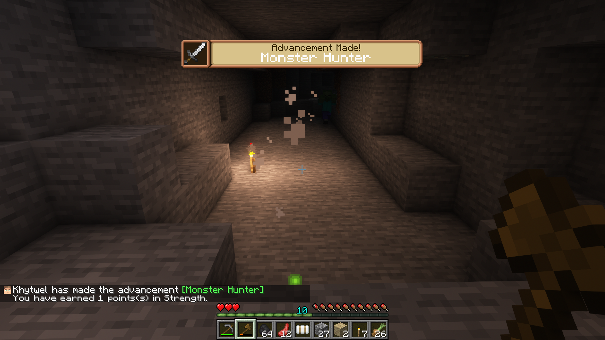
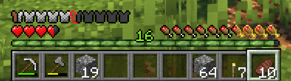
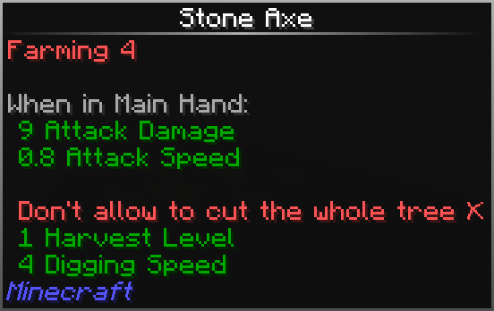

# Changelog

##  1.18.2 


To enjoy the best possible experience, don't forget to check that the resource packs are activated in the following order (after first installation or update):\
\
• xali's Bushy Leaves\
• xali's Enhanced Jungle Wood\
• xali's Enhanced Vanilla\
• xali's Enhanced Modded\
• xali's Enchanced Biome River Pond\
• xali's Potions\
• xali's Enchanted Books\
• Fantasy Ores\
• Fantasy Ores Modded\
• Eclectic Trove\
\
**Note:** Some launchers (such as GDLauncher) do not install resource packs automatically anymore. The above packs may need to be manually added to the modpack if you are using a launcher other than the CurseForge App.


### 1.4.2b - **Nature** Update 

Fabric 0.14.9

#### **Mod(s) updated:**

* Iris 1.3.1

#### **Patch Notes:**

* Use tags for copper nuggets in recipes.

### 1.4.2a - **Nature** Update 

Fabric 0.14.9


**If you have a "Loading NBT data" error when joining your server, please use the old** [**version 1.2.7**](https://www.curseforge.com/minecraft/mc-mods/irisshaders/files/3954788) **of Iris.** This is a client-side mod.


#### **Mod(s) updated:**

* Iris 1.3.0

#### **Patch Notes:**

* Fixed issue with advancements rewards for skill points.

### 1.4.2 - **Nature** Update 

Fabric 0.14.9

#### **Mod(s) added:**

* [Carpenter](https://www.curseforge.com/minecraft/mc-mods/carpenter)
* [Create Support for Open Parties and Claims](https://www.curseforge.com/minecraft/mc-mods/open-parties-and-claims)
* [Enchanted Vertical Slabs](https://www.curseforge.com/minecraft/mc-mods/enchanted-vertical-slabs)
* [Enchanted Vertical Slabs - BetterEnd Edition](https://www.curseforge.com/minecraft/mc-mods/enchanted-vertical-slabs-betterend-edition)
* [Iris & Oculus Flywheel Compat](https://www.curseforge.com/minecraft/mc-mods/iris-flywheel-compat)
* [KubeJS Create](https://www.curseforge.com/minecraft/mc-mods/kubejs-create)
* [Naturalist](https://www.curseforge.com/minecraft/mc-mods/naturalist)

#### **Mod(s) removed:**

* Notes Fabric

#### **Mod(s) updated:**

* Additional Enchanted Miner 18.5.0
* Advancement Plaques 1.4.6
* AppleSkin 2.4.1
* Applied Energistics 2 11.1.7
* Architectury API 4.9.83
* Blockus 2.4.8
* Bookshelf 13.2.50
* Chisels & Bits 1.2.114
* Cloth Config API 6.4.90
* Collective 4.52
* Connectible Chains 2.1.2+1.18.2
* Continuity 2.0.1
* Controlling 9.0+22
* Create 0.5.0d-731
* Decorative Blocks 2.1.1
* Ecologics 1.7.9
* Etched 2.2.0
* Fabric Language Kotlin 1.8.3+kotlin.1.7.10
* Farmer's Delight 1.2.1
* Forge Config API Port v3.2.4
* GeckoLib 3.0.60
* Iris Shaders 1.2.7
* KubeJS 1802.5.5-build.546
* Legendary Tooltips 1.3.3
* Megane 7.9.0
* Open Parties and Claims 0.12.0
* Pollen 1.5.0
* Reese's Sodium Options 1.4.7-build.58
* Rhino 1802.2.0-build.232
* Roughly Enough Items 8.3.529
* Shulker Box Slot 2.0.2
* Simple Copper Pipes 1.11b-1.18.2b5
* Sodium Extra 0.4.10-build.63
* TerraBlender 1.2.0.126
* WTHIT 4.13.3
* Xaero's Minimap 22.14.1
* Xaero's World Map 1.27.0
* You're in Grave Danger 1.3.9

#### **Patch Notes:**

* Added [Complementary Reimagined](https://www.complementary.dev/reimagined/) shader, with the advantage of having better performance than Complementary Shaders Version 4.
* Added unification and compatibility changes between Create and Tech Reborn.
* General script cleanup and formatting.

### 1.4.1 - **Create** Update 

Fabric 0.14.8

#### **Mod(s) added:**

* [Etched](https://www.curseforge.com/minecraft/mc-mods/etched)
* [Open Parties and Claims](https://www.curseforge.com/minecraft/mc-mods/open-parties-and-claims)

#### **Mod(s) removed:**

* Advancement Screenshot

#### **Mod(s) updated:**

* Additional Enchanted Miner 18.4.617
* Advancement Screenshot 3.5
* Applied Energistics 2 11.1.5
* Architectury API 4.8.80
* Balm 3.2.0+0
* Bookshelf 13.2.47
* Collective 4.36
* Create 0.5.0c-708
* Ecologics 1.7.7
* Fabric API 0.58.0
* FancyMenu 2.12.1
* Forge Config API Port v3.2.3
* GeckoLib 3.0.54
* Immersive Portals 1.4.9
* Indium 1.0.7
* Iris Shaders 1.2.6
* Konkrete 1.5.0
* KubeJS 1802.5.4-build.533
* Pollen 1.4.8
* Rhino 1802.1.14-build.209
* Roughly Enough Items 8.3.519
* Simple Copper Pipes 1.11b
* Simple Discord RPC 3.1.1
* Sodium Extra 0.4.6-build.46
* Xaero's Minimap 22.13.0
* Xaero's World Map 1.26.2

#### **Patch Notes:**

* Updated translations.

### 1.4.0 - **Maintenance** Update 

Fabric 0.14.8

#### **Mod(s) added:**

* [Locksmith](https://www.curseforge.com/minecraft/mc-mods/locksmith)
* [Simple Copper Pipes](https://www.curseforge.com/minecraft/mc-mods/simple-copper-pipes)

#### **Mod(s) removed:**

* Pipe

#### **Mod(s) updated:**

* Charm of Undying 2.0.2
* Chisels & Bits 1.2.113
* Ecologics 1.7.4
* Enderscape 0.3.4
* Enhanced Mushrooms 4.0.1
* Fabric Language Kotlin 1.8.2+kotlin.1.7.10
* FancyMenu 2.11.1
* GeckoLib 3.0.51
* Iron Chests 1.7.4
* Konkrete 1.4.0-1
* KubeJS 1802.5.4-build.524
* Locksmith 1.0.3
* Megane 7.8.0
* Mouse Wheelie 1.10.2
* Pollen 1.4.6
* Reese's Sodium Options 1.4.4-build.46
* Rhino 1802.1.14-build.204
* Roughly Enough Items 8.3.510
* Valhelsia Core 0.4.0
* Xaero's Minimap 22.12.0
* Xaero's World Map 1.26.1

#### **Patch Notes:**

* Allowed copper plates and sheets to be interchangable where appropriate.
* Added compatibility for the different blocks and armors with Visuality.
* Added Mimic entity to the blacklist of WTHIT.
* Added Chinese Simplified and updated French translations.
* Decreased the render distance from 12 to 10.
* Removed the generation of water lentils that caused shader issues.
* Fixed a bug with the Armored and Crystalite Elytra for LevelZ that required a certain level in defense.
* Fixed the space between some buttons in the custom menu.
* Updated Complementary Shaders to the latest version 4.5.1.

### 1.3.2 - **Maintenance** Update 

Fabric 0.14.8

#### **Mod(s) added:**

* [Anchor](https://www.curseforge.com/minecraft/mc-mods/anchor)
* [Enhanced Mushrooms](https://www.curseforge.com/minecraft/mc-mods/enhanced-mushrooms)
* [Krypton](https://www.curseforge.com/minecraft/mc-mods/krypton)
* [Mannequins](https://www.curseforge.com/minecraft/mc-mods/mannequins)
* [TimeOutOut](https://www.curseforge.com/minecraft/mc-mods/timeoutout-fabric)

#### **Mod(s) removed:**

* Connectivity

#### **Mod(s) updated:**

* Advancement Plaques 1.4.5
* Applied Energistics 2 11.1.4
* Architect's Palette 2.2
* Architectury API 4.5.76
* Bedspreads 1.6.0
* CIT Resewn 1.1.1
* Capybara 1.0.6
* Cherished Worlds 2.0.2
* Chisels & Bits 1.2.108
* Controlling 9.0+21
* Create v0.4.1+637
* Custom Stars 1.1
* Ecologics 1.7.2
* Enderscape 0.3.3
* Fabric API 0.57.0
* Fabric Language Kotlin 1.8.1+kotlin.1.7.0
* FallingTree 3.5.3
* FancyMenu 2.9.1
* GeckoLib 3.0.50
* Immersive Portals 1.4.8
* Indium 1.0.6
* Iron Chests 1.7.2
* Konkrete 1.3.3-4
* KubeJS 1802.5.4-build.510
* Legendary Tooltips 1.2.5
* Megane 7.7.2
* Mob Scarecrows 2.1.1
* Mod Menu 3.2.3
* Mouse Wheelie 1.10.1
* Patchouli 71.1
* Pipe 1.7.1
* Presence Footsteps 1.5.1
* Raised 1.1.2
* Replanter 1.3
* Rhino 1802.1.14-build.190
* Roughly Enough Items 8.3.502
* Twigs 1.1.3-patch2
* Xaero's Minimap 22.10.0
* Xaero's World Map 1.24.0
* You're in Grave Danger 1.3.7

#### **Patch Notes:**

* Added config option to disable Terralith's Traveller's Maps (found in some structure chests). Maps are now disabled by default due to the excessive lag caused by them - edit `vevconfig.json` if you wish to enable them again.
* Added additional LevelZ information to enchanting table tooltip to show level requirements for Tiers 2 & 3.
* Added custom GUI elements - new health, armor, & food icons, item selection border, and button hover border. &#x20;
* Added six new paintings and updated three existing paintings.
* Fixed an issue when using the scroll wheel to transfer items to or from an inventory.
* Blacklisted Tech Reborn's alarm in Carrier to allow modifying the alarm's settings (thanks Anner Visser).
* Changed advancement rewards script so that the rewards still work when using custom nicknames on a server.

### 1.3.1 - **Maintenance** Update 

Fabric 0.14.7

#### **Mod(s) removed:**

* Savage Ender Dragon

#### **Mod(s) updated:**

* Create v0.4.1+631
* FancyMenu 2.8.0-1
* megane 7.6.0
* Mouse Wheelie 1.9.1
* Roughly Enough Items 8.2.490

#### **Patch Notes:**

* Updated Complementary Shaders to the latest version 4.5.

### 1.3.0 - **Biome** Update 

Fabric 0.14.7

#### **Mod(s) added:**

* [Better Compatibility Checker](https://www.curseforge.com/minecraft/mc-mods/better-compatibility-checker)
* [Cave Enhancements](https://www.curseforge.com/minecraft/mc-mods/cave-enhancements)
* [CleanCut](https://www.curseforge.com/minecraft/mc-mods/cleancut)
* [Controlling](https://www.curseforge.com/minecraft/mc-mods/controlling)
* [Enderscape](https://www.curseforge.com/minecraft/mc-mods/enderscape)
* [Feature NBT Deadlock Be Gone](https://www.curseforge.com/minecraft/mc-mods/feature-nbt-deadlock-be-gone)
* [Reese's Sodium Options](https://www.curseforge.com/minecraft/mc-mods/reeses-sodium-options)
* [Sodium Extra](https://www.curseforge.com/minecraft/mc-mods/sodium-extra)
* [Starlight](https://www.curseforge.com/minecraft/mc-mods/starlight)

#### **Mod(s) removed:**

* Despawning Eggs Hatch
* InvMove
* InvMoveCompats
* Phosphor

#### **Mod(s) updated:**

* Additional Additions 4.0.5
* Additional Enchanted Miner 18.4.573
* AdventureZ 1.4.11
* Applied Energistics 2 11.1.2
* Architect's Palette 2.1
* ~~Architectury API 4.4.71~~
* BCLib 1.4.7
* Balm 3.1.0+0
* Better Fps - Render Distance 1.8
* BetterEnd 1.1.1
* Bookshelf 13.2.21
* CIT Resewn 1.1.0
* Chisels & Bits 1.2.90
* Collective 4.27
* Connectivity 3.2
* Continuity 2.0.0
* Couplings 1.8.1
* Crafting Tweaks 14.0.3
* Create v0.4.1+628
* CreativeCore v2.6.12
* DragonLoot 1.1.0
* Dusk 2.1
* Enchanted ToolTips 1.3.6
* Fabric API 0.56.0
* Fabric Language Kotlin 1.8.0+kotlin.1.7.0
* FancyMenu 2.8.0
* GeckoLib 3.0.47
* Harvest Scythes 2.5.1
* Immersive Portals 1.4.5
* Immersive Weathering 2.5.6
* Infusion Table 1.1.0
* Iris Shaders 1.2.5
* Iron Chests 1.7.0
* KleeSlabs 11.1.1
* ~~KubeJS 1802.5.4-build.492~~
* LevelZ 1.3.3
* Mob Scarecrows 2.1.0
* Mouse Wheelie 1.9.0
* Patchouli 70
* Quartz Elevator 2.1.2
* Rhino 1802.1.14-build.182
* Roughly Enough Items 8.2.47
* RpgDifficulty 1.0.12
* Savage Ender Dragon 2.4
* ToolStats 9.0.3
* WTHIT 4.11.0
* Waystones 10.1.0
* Wilder World 2.2.2
* Xaero's Minimap 22.9.2
* Xaero's World Map 1.23.2
* oωo 0.7.2
* spark 1.9.11

#### **Patch Notes:**

* Disabled Emissive Textures from Continuity.
* Enabled by default the ressource packs Connected Glass" from Continuity and Support Eating Animation.
* Improved the default config for Xaero's Minimap, Xaero's World Map and Roughly Enough Items.
* The Roughly Enough Items search bar is now at the bottom right.
* Gived Freeze Immunity to Penguin and allow Penguins & Squirrels to walk on Powder Snow.

### 1.2.3 - **Maintenance** Update 

Fabric 0.14.6

#### **Mod(s) removed:**

* Keymap

#### **Mod(s) updated:**

* Additional Additions 4.0.3
* Additional Enchanted Miner 18.4.569
* Applied Energistics 2 11.0.0
* Architectury API 4.4.68
* AttributeFix 14.0.2
* BetterF3 1.2.5
* Blockus 2.4.7
* Create Fabric v0.4.1+586
* CreativeCore v2.6.11
* Eating Animation 1.8
* Fabric API 0.53.4
* FancyMenu 2.7.2
* Immersive Portals 1.4.0
* Immersive Weathering 2.5.3
* Iron Chests 1.6.1
* KubeJS 1802.5.3-build.463
* Lithium 0.7.10
* Patchoul 69
* Polymorph 0.0.21
* Reborn Core 5.2.0
* Rhino 1802.1.13-build.175
* Roughly Enough Items 8.2.470
* Savage Ender Dragon 2.3
* Tech Reborn 5.2.0
* Xaero's Minimap 22.8.2
* Xaero's World Map 1.22.0
* You're in Grave Danger 1.3.6

#### **Patch Notes:**

* Added unification between Farmer's Delight and Immersive Weathering for tree bark.
* Added language entries for all Terralith biomes.
* Added some unification between Tech Reborn and Create (Zinc + Brass mainly).
* Temporarily remove axe stripping from Farmer's Delight script (bug in mod).

### 1.2.2 - **Creativity** Update 

Fabric 0.14.5

#### **Mod(s) added:**

* Advancements Debug
* [Create](https://www.curseforge.com/minecraft/mc-mods/create-fabric)
* [Illuminations](https://www.curseforge.com/minecraft/mc-mods/illuminations)
* [InvMove](https://www.curseforge.com/minecraft/mc-mods/invmove)
* InvMoveCompats
* [Keymap](https://www.curseforge.com/minecraft/mc-mods/keymap)
* Not Enough Crashes
* [Pyrotastic](https://www.curseforge.com/minecraft/mc-mods/pyrotastic)
* [Wilder World](https://www.curseforge.com/minecraft/mc-mods/wilder-world)

#### **Mod(s) removed:**

* Clean Cut (no longer works)
* Controlling
* Disable Custom Worlds Advice
* SlimyFloor

#### **Mod(s) updated:**

* Additional Additions 4.0.1
* Additional Enchanted Miner 18.4.566
* BCLib 1.4.6
* Better Ping Display 1.1.1
* Chalk 2.0.1
* Clickable advancements 2.6
* Cloth Config API 6.2.62
* Creeper Overhaul 1.3.1
* Dual Riders 1.1.1
* Falling Leaves 1.11.1
* Flytre Lib 1.8.1
* GeckoLib 3.0.42
* Immersive Portals 1.3.7
* KubeJS 1802.5.2-build.428
* Mod Menu 3.2.2
* Paintings ++ 9.1.2.1
* Raised 1.1.1
* Rhino 1802.1.12-build.171
* Simple Discord RPC 3.0.1
* Sprout 1.3.1
* ThonkUtil 2.14.1
* Trinkets 3.3.1
* WTHIT 4.10.3
* Xaero's Minimap 22.7.0
* Xaero's World Map 1.21.2
* You're in Grave Danger 1.3.5

#### **Patch Notes:**

* Added new [advancements rewards](knowledge-base.md#advancement) (for LevelZ) with Create.
* Changed position of the warp button to avoid incompatibility with Trinkets.

### 1.2.1 - **Maintenance** Update 


When updating an existing world (from 1.1.x, harsh chunk borders WILL be present and some missing blocks (for example [Better Azalea](https://www.curseforge.com/minecraft/mc-mods/better-azalea) which merged with [Ecologics](https://www.curseforge.com/minecraft/mc-mods/ecologics)). Here is the list of the missing mods:\

* Anchor
* Artifality
* Glassential
* Illuminations
* Locksmith
* Luminous Wool
* Mannequins


Fabric Loader 0.14.4

#### **Mod(s) added:**

* Connectivity
* [Pipe](https://www.curseforge.com/minecraft/mc-mods/pipe)

#### **Mod(s) removed:**

* AntiGhost
* Saplanting
* TimeOutOut

#### **Mod(s) updated:**

* Dual Riders 1.1.1
* Falling Leaves 1.11.0
* KubeJS 1802.5.1-build.382
* Oxidized 1.6.4
* owo lib 0.7.2
* WTHIT 4.10.1
* YUNG's API 2.0.8

#### **Patch Notes:**

* Added Viridite to level 15 of mining source.

### 1.2.0 - 1.18.2 Update 


When updating an existing world, harsh chunk borders WILL be present and some missing blocks (for example [Better Azalea](https://www.curseforge.com/minecraft/mc-mods/better-azalea) which merged with [Ecologics](https://www.curseforge.com/minecraft/mc-mods/ecologics)). Here is the list of the missing mods:\

* Anchor
* Artifality
* Glassential
* Illuminations
* Locksmith
* Luminous Wool
* Mannequins
* Pipe (could break your sorting automation if you use it, should be updated "soon" according to its author)


Fabric Loader 0.14.4

#### **Mod(s) added:**

* [Farmer's Delight](https://www.curseforge.com/minecraft/mc-mods/farmers-delight-fabric)
* [Friendly Fire](https://www.curseforge.com/minecraft/mc-mods/friendly-fire)
* [Immersive Weathering](https://www.curseforge.com/minecraft/mc-mods/immersive-weathering-fabric) (from 1.2.0-pre1)
* [Savage Ender Dragon](https://www.curseforge.com/minecraft/mc-mods/savage-ender-dragon) (from 1.2.0-pre3)
* [Sprout](https://www.curseforge.com/minecraft/mc-mods/sprout) (from 1.2.0-pre3)
* [Trinket Shulker Boxes](https://www.curseforge.com/minecraft/mc-mods/trinkets-fabric) (from 1.2.0-pre3)
* Valhelsia Tweaks
* [Wolves With Armor](https://www.curseforge.com/minecraft/mc-mods/wolves-with-armor)
* [YUNG's Better Dungeons](https://www.curseforge.com/minecraft/mc-mods/yungs-better-dungeons-fabric)
* [YUNG's Better Strongholds](https://www.curseforge.com/minecraft/mc-mods/yungs-better-strongholds-fabric)

#### **Mod(s) updated:**

* Additional Additions 4.0.0
* Architectury API 4.3.53
* BCLib 1.4.5
* bad packets 0.1.2
* Capybara 1.0.4
* Chisels & Bits 1.2.87
* FallingTree 3.5.1
* FancyMenu 2.7.0
* Farsight 1.9
* Guard Villagers 1.0.12
* Guard Villagers 1.0.13
* Iris Shaders 1.2.4-build.38
* Iron Chests 1.5.6
* KubeJS 1802.5.1-build.377
* owo lib 0.7.1
* Raised 1.0.8
* Sprout 1.2.0
* Valhelsia Core 3.0.1
* WTHIT 4.9.1

#### **Patch Notes:**

* Tools and armor in Rose Gold is now available, hurrah!
* Improved F3 interface.
* The translations into Chinese Simplified, German and Italian are now available. We are seeking help from the community to translate our projects, and you can find out how to [contribute translations here](https://wiki.valhelsia.net/navigation/translation/) if you think you can help!

### 1.2.0-pre4 - 1.18.2 Update 


When updating an existing world, harsh chunk borders WILL be present. Some mods are not yet up to date, we advise you to wait for the official release of 1.2.0. Here is the list of the missing mods:\

* Anchor
* Artifality
* Farmer's Delight
* Glassential
* Illuminations
* Locksmith
* Luminous Wool
* Mannequins
* Pipe
* Pollen
* Wolves With Armor
* YUNG's Better Dungeons
* YUNG's Better Strongholds


Fabric Loader 0.14.2

#### **Mod(s) added:**

* [BetterEnd](https://www.curseforge.com/minecraft/mc-mods/betterend)

#### **Mod(s) updated:**

* Applied Energistics 2 11.0.0-alpha.5
* Auth Me 3.1.0
* Blockus 2.4.5
* Bookshelf 13.0.13
* Chisels & Bits 1.2.85
* Ecologics 1.5.4
* Fabric API 0.51.1
* Fabric Language Kotlin 1.7.4+kotlin.1.6.21
* FallingTree 3.5.0
* FancyMenu 2.6.6
* FerriteCore 4.2.1
* Indium 1.0.3
* Iris Shaders 1.2.3-build.35
* KubeJS 1802.5.1-build.353
* Login Protection 1.6
* Megane 7.4.0
* Mod Menu 3.2.1
* Reborn Core 5.2.0-beta.3
* Roughly Enough Items 8.1.457
* Saplanting 1.1
* Savage Ender Dragon 2.1
* Spyglass Improvements 1.2
* Tech Reborn 5.2.0-beta.3
* WTHIT 4.9.0
* Xaero's Minimap 22.6.1
* Xaero's World Map 1.20.7
* megane 7.5.1
* oωo 0.7.0
* spark 1.9.1

#### **Patch Notes:**

* Adjusted tooltip and mod name colours.

### 1.2.0-pre3 - 1.18.2 Update 


When updating an existing world, harsh chunk borders WILL be present. Some mods are not yet up to date, we advise you to wait for the official release of 1.2.0. Here is the list of the missing mods:\

* Anchor
* Artifality
* BetterEnd
* Farmer's Delight
* Glassential
* Illuminations
* Locksmith
* Luminous Wool
* Mannequins
* Pipe
* Pollen
* Wolves With Armor
* YUNG's Better Dungeons
* YUNG's Better Strongholds


Fabric Loader 0.13.3

#### **Mod(s) added:**

* [Savage Ender Dragon](https://www.curseforge.com/minecraft/mc-mods/savage-ender-dragon)
* [Sprout](https://www.curseforge.com/minecraft/mc-mods/sprout)
* [Trinket Shulker Boxes](https://www.curseforge.com/minecraft/mc-mods/trinkets-fabric)

#### **Mod(s) updated:**

* Ambient Environment 7.0+19
* Architectury API 4.2.50
* Artifacts 7.0.3
* Blockus 2.4.4
* Chisels & Bits 1.2.84
* Controlling 9.0+19
* Crawl 0.10.6
* CreativeCore v2.6.10
* Dusk 1.9
* Fabric API 0.51.0
* FancyMenu 2.6.5
* GeckoLib 3.0.38
* KubeJS 1802.5.1-build.342
* Nears 1.1.8
* Raised 1.0.7
* Simple Discord RPC 3.0.0

### 1.2.0-pre2 - 1.18.2 Update 


When updating an existing world, harsh chunk borders WILL be present. Some mods are not yet up to date, we advise you to wait for the official release of 1.2.0. Here is the list of the missing mods:\

* Anchor
* Artifality
* BetterEnd
* Farmer's Delight
* Glassential
* Illuminations
* Locksmith
* Luminous Wool
* Mannequins
* Pipe
* Pollen
* Wolves With Armor
* YUNG's Better Dungeons
* YUNG's Better Strongholds


Fabric Loader 0.13.3

#### **Mod(s) added:**

* Mod Menu
* Public Gui Announcement

#### **Mod(s) updated:**

* Additional Enchanted Miner 18.2.521
* Architectury API 4.2.48
* Bookshelf 13.0.12
* Eating Animation 1.6
* Fabric Language Kotlin 1.7.3+kotlin.1.6.20
* GeckoLib 3.0.37
* KubeJS 1802.5.1-build.335
* Paintings 9.1.1.0
* Roughly Enough Items 8.1.449
* Saplanting 1.1-rc-3

#### **Patch Notes:**

* Valhelsia cosmetics are now available for Fabric! To support us and get a beautiful Valhelsia Cape available on all our different modpacks and mods it's [here](https://store.valhelsia.net/).
* Fixed the custom menu.
* Fixed Rainbow Glowstone recipe that gave 4 instead of 1.
* Added recipes to unify some blocks and items (Snow Bricks, Mossy Bricks, Polished Amethyst Bricks, Polished Amethyst, ...).

### 1.2.0-pre1 - 1.18.2 Update 


When updating an existing world, harsh chunk borders WILL be present. Some mods are not yet up to date, we advise you to wait for the official release of 1.2.0. Here is the list of the missing mods:\

* Anchor
* Artifality
* BetterEnd
* Farmer's Delight
* Glassential
* Illuminations
* Locksmith
* Luminous Wool
* Mannequins
* Pipe
* Pollen
* Wolves With Armor
* YUNG's Better Dungeons
* YUNG's Better Strongholds


Fabric Loader 0.13.3

#### **Mod(s) added:**

* [AmbientSounds 5](https://www.curseforge.com/minecraft/mc-mods/ambientsounds)
* [Immersive Weathering](https://www.curseforge.com/minecraft/mc-mods/immersive-weathering-fabric)
* Valhelsia Core

#### **Mod(s) removed:**

* Better Azalea (moved to Ecologics)

#### **Mod(s) updated:**

* Too much.

#### **Patch Notes:**

* ~~Valhelsia cosmetics are now available for Fabric! To support us and get a beautiful Valhelsia Cape available on all our different modpacks and mods it's~~ [~~here~~](https://store.valhelsia.net/)~~.~~\
  &#xNAN;**(Edit: the Valhelsia Cosmetics button is missing, this should be fixed for the next version)**
* Effects are now displayed on the left side of the inventory.
* There is now only one version of the shader that you can configure from the menu to focus on performance, quality, or somewhere in-between.
* The meteorites are back!

## ​ 1.18.1 


To enjoy the best possible experience, don't forget to check that the resource packs are activated in the following order (after first installation or update):\
\
• xali's Bushy Leaves\
• xali's Enhanced Jungle Wood\
• xali's Enhanced Vanilla\
• xali's Enhanced Modded\
• xali's Enchanced Biome River Pond\
• xali's Potions\
• xali's Enchanted Books\
• Fantasy Ores\
• Fantasy Ores Modded\
• Eclectic Trove\
\
**Note:** Some launchers (such as GDLauncher) do not install resource packs automatically anymore. The above packs may need to be manually added to the modpack if you are using a launcher other than the CurseForge App.


### 1.1.2 - Maintenance Update 

Fabric Loader 0.13.3

#### **Mod(s) added:**

* [Ecologics](https://www.curseforge.com/minecraft/mc-mods/ecologics)

#### **Mod(s) updated:**

* Architectury API 3.7.37
* BisectHosting Server Integration Menu 1.3
* Blockus 2.3.10
* Bookshelf 12.0.22
* CIT Resewn 1.0.1
* Connectible Chains 2.1.0
* Guard Villagers 1.0.10
* Mannequins 2.1.0
* Mouse Wheelie 1.8.8-pre5
* Not Enough Animations 1.5.0
* Pollen 1.3.1
* Polymorph 0.0.20
* Raised 1.0.4
* Rhino 1801.1.9-build.120
* WTHIT 4.5.5

#### **Patch Notes:**

* Added recipes to create Sky Stone via the Implosion Compressor while waiting for the meteorite generation problem to be fixed (normally fixed for 1.18.2).
* Added AE2 presses to End City loot.
* Added AE2 blocks to the blacklist from Carrier.
* Added Rose Gold tools & armor to the blacklist from REI until we can balance it.
* Disabled the highlight locked blocks in red when you don't have the necessary level to break them.

### 1.1.1b - Maintenance Update 

Fabric Loader 0.13.3

#### **Patch Notes:**

* Fixed config file for LevelZ.
* The required XP to gain a skill point can no longer exceed 10 000 XP for the highest levels.

### 1.1.1a - Maintenance Update 

Fabric Loader 0.13.3

#### **Mod(s) removed:**

* Immersive Weathering (Performance Issue)

### 1.1.1 - Maintenance Update 

Fabric Loader 0.13.3

#### **Mod(s) added:**

* [Artifacts](https://www.curseforge.com/minecraft/mc-mods/artifacts-fabric)
* [Dyed](https://www.curseforge.com/minecraft/mc-mods/dyed)
* [Immersive Weathering](https://www.curseforge.com/minecraft/mc-mods/immersive-weathering)
* [Raised](https://www.curseforge.com/minecraft/mc-mods/raised)

#### **Mod(s) removed:**

* Direbats (Memory Issue)

#### **Mod(s) updated:**

* AdventureZ 1.4.9
* Architectury 3.7.31
* BCLib 1.3.5
* BetterEnd 1.0.3
* Blockus 2.3.6
* Chisels & Bits 1.2.82
* Clear Despawn 1.1.7
* Clickable advancements 2.5
* Comforts 1.0.3
* Fabric API 0.46.6
* FancyMenu 2.6.4
* Guard Villagers 1.0.9
* Indium 1.0.2-alpha3
* KubeJS 1801.4.3-build.310
* Levelz 1.2.0
* Pistorder v1.5.0
* Quartz Elevator 2.1.1
* Roughly Enough Items 7.3.443
* RpgDifficulty 1.0.11
* Tool Stats 8.0.6
* Xaero's Minimap 22.3.0
* You're in Grave Danger 1.2.22

#### **Patch Notes:**

* Silver armor now requires two defense points to be equipped.
* Fixed default server icon for the server pack.

### 1.1.0a - Maintenance Update 

Fabric Loader 0.13.3

#### **Mod(s) removed:**

* Creatures From The Jungle!
* Creatures From The Snow!


Some assets in Creatures From The Jungle! were deliberately stolen and used without the permission of the artist in question. We do not condone this kind of thing in any way, which is why we have decided to remove these two mods.


#### **Patch Notes:**

* Fixed typo in the default resource pack config.

### 1.1.0 - Exploration Update 

Fabric Loader 0.13.3

#### **Mod(s) added:**

* AdvancementInfo
* Anchor
* Better Azalea
* Blossom
* Chat Heads
* Chisels & Bits
* Clickable advancements
* Companion
* Crawl
* Creatures From The Jungle!
* Creatures From The Snow!
* Creeper Overhaul
* Detail Armor Bar
* Farsight
* Fast Furnace for Fabric
* FastBench for Fabric
* Goblin Traders
* Locksmith
* Mannequins
* Mob Scarecrows
* Saplanting
* TimeOutOut
* Trinket of Undying
* YUNG's Better Dungeons
* YUNG's Better Strongholds

#### **Resource Pack(s) added:**

* Fantasy Ores Modded

#### **Mod(s) updated:**

* Advancement Plaques 1.4.4
* Applied Energistics 2 10.1.0-beta.2
* Architect's Palette 1.6
* Architectury API 3.7.26
* Artifality 0.5.5
* BCLib 1.3.4
* Balm 2.4.3+0
* Better Mount HUD 1.1.4
* BetterEnd 1.0.2
* Chalk 1.2.2
* Cloth Config API 6.2.57
* Collective 4.9
* Comforts 1.0.2
* Continuity 1.1.0
* Controlling 9.0+15
* Eating Animation 1.5
* Entity Culling 1.5.0
* Fabric API 0.46.4
* FallingTree 3.2.1
* FancyMenu 2.6.3
* FerriteCore 4.1.2
* GeckoLib 3.0.33
* Guard Villagers 1.0.7
* Iron Chests 1.5.4
* KubeJS 1801.4.2-build.307
* Legendary Tooltips 1.2.4
* LevelZ 1.1.6
* Lithium 0.7.8
* Megane 7.1.3
* Mouse Wheelie 1.8.3-pre5
* Oxidized 1.6.1
* Reborn Core 5.1.0
* Rhino 1801.1.8-build.102
* Roughly Enough Items 7.3.432
* Simple Discord RPC 2.7.2
* Spark 1.8.6
* Spyglass Improvements 1.1
* Tech Reborn 5.1.0
* Trinkets 3.2.0
* Visuality 0.4.1
* WTHIT 4.5.4
* Waystones 9.0.4
* Xaero's Minimap 22.2.0.1
* Xaero's World Map 1.20.3.1
* You're in Grave Danger 1.2.20
* oωo 0.5.2

#### **Patch Notes:**

* Added a new way to earn skill points. By obtaining certain advancements, you will be rewarded points in relevant skills, or unallocated skill points to spend freely however you wish. You can find the full list of advancement rewards [here](knowledge-base.md#advancement). More rewards will be added in future updates and we look forward to your feedback on this new system!\
  \
  For those who wish to progress faster, you can always activate an alternative system by typing this command in your chat`!vconfig simple_advancement_points true`. This will give you 1 skill point for a task advancement, 2 skill points for a goal advancement and 3 skill points for a challenge advancement. You can also optionally disable the advanced system using`!vconfig individual_advancement_points false`. Config commands can only be used with cheats enabled or by an op on a server. Alternatively, the `vev_config.json` file can be edited directly.

* Changed the XP equation from 0.08 to 0.07, it will now take less XP to gain a new skill point at higher levels.
* Removed the recipes to convert wool to string using a machete (due to missing functionality in KubeJS). Use the Cutting Board from Farmer's Delight instead.
* Fixed a conflict with LevelZ and Public Gui Announcement that caused a missing texture on the Skills Interface.
* Fixed log error in Oxidized Copper Kiln model.
* Fixed log error of conflict with Advancement Plaques and WTHIT.
* Fixed XP duplication with Tech Reborn and allowed Tech Reborn's raw ore blocks to be crafted + uncrafted.
* Reworked textures of Iron Chests (Fabric) based on the Forge mod.

* Advancement Plaques are now displayed lower down to prevent overlapping with the WTHIT display.
* The armor part of Inventory HUD+ is now disabled by default (replaced by Detail Armor Bar).

* Unified Ender Blocks and Ender Pearl Dusts.

### 1.0.7 - Maintenance Update 

Fabric Loader 0.12.12

#### **Mod(s) added:**

* Guard Villagers
* Spyglass Improvements

#### **Mod(s) updated:**

* AppleSkin 2.3.0
* Arcanus 1.27
* Architectury API 3.6.15
* Carrier 1.9.1
* Comforts 1.0.1
* Controlling 9.0+14
* Fabric API 0.46.3
* FallingTree 3.2.0b2
* FancyMenu 2.6.1
* Flytre Lib 1.7.1
* GeckoLib 3.0.32
* KubeJS 1801.4.2-build.296
* Megane 7.0.2
* Patchouli 65
* Pipe 1.6.2
* Reborn Core 5.1.0-beta.8
* Rhino 1801.1.8-build.99
* Roughly Enough Items 7.2.418
* Tech Reborn 5.1.0-beta.8
* Tool Stats 8.0.3
* Xaero's Minimap 22.1.2
* Xaero's World Map 1.20.1
* owo lib 0.5.1

#### **Patch Notes:**

* Ores from Tech Reborn are now generated in the Terralith biomes.
* The enchantment of Falling Tree is now hidden.
* Blacklisted Arcanus Display Case from being able to be picked up (since the default keybind prevents opening it).

### 1.0.6 - Maintenance Update 

Fabric Loader 0.12.12

#### **Mod(s) added:**

* Connectible Chains

#### **Mod(s) updated:**

* Ambient Environment 7.0.4
* Arcanus 1.26
* Artifality 0.5.4
* AttributeFix 13.0.5
* BCLib 1.2.5
* BetterEnd 1.0.1
* CaveTweaks v1.2
* Clear Despawn 1.1.6
* Controlling 9.0+13
* Decorative Blocks 2.0.4
* FancyMenu 2.6.0
* Flytre Lib 1.6.7
* GeckoLib 3.0.30
* Harvest Scythes 2.4.1
* Immersive Portals 1.2.5
* Legendary Tooltips 1.2.2
* Pipe 1.6.1
* Quartz Elevator 2.1.0
* Roughly Enough Items 7.1.390
* RpgDifficulty 1.0.9
* ToolStats 8.0.2
* Xaero's World Map 1.20.0
* You're in Grave Danger 1.2.13
* oωo 0.4.0

#### **Patch Notes:**

* Fixed render issue with rabbit.
* Updated the blacklist of REI for some Tech Reborn ores.
* Added Xaero's Minimap to have the waypoints. The minimap is disabled by default and configured if you want to activate it.

### 1.0.5 - Maintenance Update 

Fabric Loader 0.12.12

#### **Mod(s) added:**

* CaveTweaks
* You're in Grave Danger

#### **Mod(s) updated:**

* Additional Enchanted Miner 18.2.0
* Applied Energistics 2 10.0.0
* Artifality 0.5.3
* BCLib 1.2.4
* Balm 2.4.1+0
* CIT Resewn 0.9.1
* Controlling 9.0.11
* Direbats 2.1.0
* Dynamic FPS 2.1.0
* Fabric API 0.46.0
* Falling Leaves 1.9.0
* Falling Tree 3.1.0
* FancyMenu 2.5.2
* Forge Config API Port v3.1.1
* GeckoLib 3.0.25
* Iceberg 1.0.38
* Immersive Portals 1.2.1
* Indium 1.0.2-alpha2
* Iris Shaders 1.1.5
* Levelz 1.1.5
* Megane 7.0.1
* Mouse Tweaks 2.22
* Notes 1.0.10
* Oxidized 1.5.3
* Polymorph 0.0.19
* Public GUI Announcement 3.2.0.0
* Reborn Core 5.1.0-beta.5
* Rhino 1800.1.7-build.94
* Roughly Enough Items 7.1.380
* Sodium 0.4.0-alpha6+build.14
* Tech Reborn 5.1.0-beta.5
* Terralith 2.0.12
* Twigs 1.1.3
* Waystones 9.0.3
* Xaero's World Map 1.19.1

#### **Patch Notes:**

* Fixed config issue with Falling Tree.
* Fixed the displaying of some tool name in the skills menu.
* Added recipes for barrel variants.
* Removed Rocky Dirt from Decorative Blocks (duplicate block).
* Removed Fried Egg recipe from Additional Additions (duplicate recipe).

### 1.0.4 - End Update 


Falling Tree does not work in this version, this will be fixed in 1.0.5.


Fabric Loader 0.12.12

#### **Mod(s) added:**

* Artifality
* Better End
* Decorative Blocks
* Direbats
* Tool Stats

#### **Mod(s) removed:**

* Effective

#### **Mod(s) updated:**

* Applied Energistics 2 10.0.0-beta.4
* Arcanus 1.25
* Architectury API 3.4.9
* BCLib 1.2.2
* Balm 2.4.0+0
* CIT Resewn 0.8.2
* Capybara 1.0.1
* Controlling 9.0.8
* Equipment Compare 1.2.11
* FallingTree 3.1.0b2
* FancyMenu 2.5.0
* Harvest Scythes 2.4.0
* Iceberg 1.0.37
* Iris Shaders 1.1.4
* Konkrete 1.3.3
* KubeJS 1801.4.1-build.271
* Legendary Tooltips 1.2.1
* LevelZ 1.1.4
* Lithium 0.7.7
* Login Protection 1.5
* Oxidized 1.5.2
* Patchouli 64
* Polymorph 0.0.18
* Public Gui Announcement 3.1.0.3
* Rhino 1800.1.7-build.92
* Roughly Enough Items 7.1.357
* RpgDifficulty 1.0.8
* Simple Discord RPC 2.7.1
* Terralith 2.0.10
* Visuality 0.4.0
* WTHIT 4.4.1
* Xaero's World Map 1.19.0
* oωo 0.3.14
* xali's Bushy Leaves v1.1
* xali's Enhanced Modded x Valhelsia v0.2.2

#### **Patch Notes:**

* New weapons in the strength category, welcome to the hammer!
* Added information to the axes if it can cut the whole tree.

* Changed the XP equation from 0.09 to 0.08, it will now take less XP to gain a new skill point at higher levels. More improvements will be made with the next update.

### 1.0.3 - Maintenance Update 

Fabric Loader 0.12.12

#### **Mod(s) added:**

* AttributeFix
* Dimension Fix
* Dual Riders
* Nears
* Phosphor
* Pipe
* Polymorph
* Public Gui Announcement
* SlimyFloor
* ToolTipFix

#### **Mod(s) updated:**

* Additional Enchanted Miner 18.1.0&#x20;
* AdventureZ 1.4.6&#x20;
* Animal Feeding Trough 1.0.3&#x20;
* Applied Energistics 2 10.0.0-beta.1&#x20;
* Architectury API 3.2.60&#x20;
* Blockus 2.3.4&#x20;
* Chalk 1.2.1&#x20;
* Chunky 1.2.164&#x20;
* Controlling 9.0.6&#x20;
* Effective 1.1&#x20;
* Fabric API 0.45.0+1.18&#x20;
* Fabric Language Kotlin 1.7.1+kotlin.1.6.10&#x20;
* Immersive Portals 1.1.7&#x20;
* Incantationem 1.1.3&#x20;
* KubeJS 1801.4.0-build.249&#x20;
* Megane 6.2.0&#x20;
* Modmenu 3.0.1&#x20;
* Mouse Tweaks 2.20&#x20;
* Owo 0.3.10&#x20;
* Quartz Elevator 2.0.1&#x20;
* Terralith v2.0.6&#x20;
* Xaero's World Map 1.18.9&#x20;
* xali's Enhanced Modded v0.2.1&#x20;
* xali's Enhanced Vanilla v1.9.1

#### **Patch Notes:**

* Added [xali's Bushy Leaves](https://www.curseforge.com/minecraft/texture-packs/xalis-bushy-leaves) resource pack.
* Updated Complementary Shaders to the version 4.3.3.

### 1.0.2 - Maintenance Update 

Fabric Loader 0.12.12

#### **Mod(s) added:**

* Ambient Environment
* Effective

#### **Mod(s) updated:**

* Additional Enchanted Miner 18.0.458&#x20;
* Advancement Screenshot 3.2&#x20;
* Applied Energistics 2 10.0.0-alpha.7&#x20;
* Auth Me 2.2.0&#x20;
* Collective 3.14&#x20;
* Falling Leaves 1.8.1&#x20;
* Falling Tree 2.16.1&#x20;
* Harvest Scythes 2.3.2&#x20;
* Immersive Portals 1.1.4&#x20;
* Levelz 1.1.3&#x20;
* Mo Glass 1.6.1&#x20;
* Mouse Tweaks 2.18&#x20;
* Oxidized 1.5.1&#x20;
* Roughly Enough Items 7.1.356&#x20;
* WTHIT 4.4.0

#### **Patch Notes:**

* Reduced the number of Rainbow Roses that generate in Meadows and Flower Forests.
* Fixed resource pack priority which caused a texture problem with the Jungle Door.
* Fixed Paper Lamp/Lantern recipe conflict between Blockus and Twigs.
* Fixed a conflict between cobweb and wool crafting recipes.
* Added a Grinder recipe to grind Marble into Marble Dust (TechReborn).
* Removed Ender Block recipe from Blockus (duplicate block).
* Improved the Quartz Elevator recipe.
* Disabled the Gold Ring from Additional Additions.
* Decreased the distance from 64 blocks to 32 for the Smooth Quartz Elevator.

### 1.0.1 - Farming Update 

Fabric Loader 0.12.11

#### **Mod(s) added:**

* Beacon Overhaul
* Better Ping Display
* Comforts
* Farmer's Delight

#### **Mod(s) updated:**

* Additional Enchanted Miner 18.0.455&#x20;
* Applied Energistics 2 10.0.0-alpha.6&#x20;
* Architectury API 3.2.51&#x20;
* Balm API 2.3.0+0&#x20;
* Cloth Config API 6.1.48&#x20;
* Falling Tree 2.16.0&#x20;
* GeckoLib 3.0.23&#x20;
* Harvest Scythes 2.3.1&#x20;
* Immersive Portals 1.1.2&#x20;
* Infusion Table 1.0.5&#x20;
* Iris 1.1.3&#x20;
* KubeJS 1801.4.0-build.245&#x20;
* LevelZ 1.1.2&#x20;
* Lithium 0.7.6&#x20;
* Mo Glass 1.5&#x20;
* Mouse Tweaks 2.17&#x20;
* Patchouli 61&#x20;
* Roughly Enough Items 7.0.352&#x20;
* Simple Discord RPC 2.6.1&#x20;
* Terralith v2.0.5&#x20;
* Twigs 1.1.2&#x20;
* Waystones 9.0.1

#### **Patch Notes:**

* Added first start message and link to [getting started guide](getting-started-guide.md). This will only display the first time you join a world.

* Added Bundle and extra Dispenser recipe.
* Added several recipes to the Cutting Board.
* Furnaces now correctly give XP.
* Farming skills have been rebalanced.
  * Farming
    * Wolf Use increased from level 2 to 3.
    * Composter Use decreased from level 3 to 2.
    * Beehive Use increased from level 6 to 11.
    * Sheep Use (shearing) decreased from level 8 to 6.
    * Loom Use decreased from level 10 to 0.
* Added new usages for the Farming skill.
  * Farming
    * Capybara Use unlocked at level 13.
    * Dragon Use unlocked at level 35.
* Changed the number of starting points to 3 instead of 1.
* Changed the XP equation from 0.1 to 0.09, it will now take less XP to gain a new skill point at higher levels.
* Some improvements and additions for the custom menu.
* Disabled the warning messages from Immersive Portals.
* The Certus Quartz Axe and Quartz Axe can no longer cut down a whole tree at once.&#x20;
* Larger trees can now be felled with an appropriate axe, and trees that are too large will now be partially cut down instead of the action failing entirely.
* Added many new types of food and crops via [Farmer's Delight](https://www.curseforge.com/minecraft/mc-mods/farmers-delight-fabric).
* The texture of the Rubber Leaves has been improved.

 

* Updated to Minecraft 1.18.1.

##  1.18 

### 1.0.0 - Release 

Fabric 0.12.8

#### **Patch Notes:**

* We have overhauled Valhelsia Fabric with a new vision and direction for the pack, the old worlds of Valhelsia Fabric are not compatible with this new version.\
  \
  **For more information:** [December 2021 News Update](https://blog.valhelsia.net/post/december-2021-news-update)

##  1.17.1

### 1.0.9 - Beta Update

Fabric 0.11.7

#### **Mod(s) added:**

* Alloy Forgery&#x20;
* Arcanus&#x20;
* Dynamic Surroundings&#x20;
* Noooooo&#x20;
* Roughly Enough Resources

#### **Mod(s) removed:**

*

#### **Mod(s) updated:**

* Applied Energistics 2 9.0.0-alpha.7&#x20;
* Architectury API 2.5.35&#x20;
* Artifality 0.4.2&#x20;
* Carrier 1.8.1&#x20;
* Clumps 7.0.10&#x20;
* Custom Stars 0.6&#x20;
* Fabric API 0.41.0&#x20;
* Falling Leaves 1.7.4&#x20;
* GeckoLib 3.0.19
* Illuminations 1.9&#x20;
* Inventory HUD+ 3.4.1&#x20;
* KubeJS 1701.3.10-build.9999&#x20;
* Light Overlay 6.0.1&#x20;
* Magic Fungi 0.5.0-BETA&#x20;
* Megane 5.5.0&#x20;
* Notes 1.0.8&#x20;
* Outvoted 1.5.0-b1&#x20;
* Pipe 1.5.0&#x20;
* Reborn Core 5.0.9-beta+build.131&#x20;
* Respawnable Pets 5&#x20;
* Rhino 1701.1.5-build.71&#x20;
* Roughly Enough Items 6.0.307-alpha&#x20;
* TechReborn 5.0.9-beta+build.131&#x20;
* Visuality 0.2.0&#x20;
* WTHIT 3.10.0

#### **Patch Notes:**

* Add new crafts for Chainmail Armor and Dispenser.
* Disable recipe book.

### 1.0.8a - Beta Update

Fabric 0.11.6

#### **Mod(s) added:**

*

#### **Mod(s) removed:**

*

#### **Mod(s) updated:**

* AdventureZ 1.3.0&#x20;
* Comforts 0.0.7&#x20;
* Fabric API 0.40.6&#x20;
* Megane 5.4.2

#### **Patch Notes:**

* Fixed REI crash on server side (this one has been removed on the server side).

### 1.0.8 - Beta Update

Fabric 0.11.6

#### **Mod(s) added:**

* Applied Energistics 2
* Farmer's Delight
* Fruitful&#x20;
* Paintings++
* Pipe&#x20;

#### **Mod(s) removed:**

*

#### **Mod(s) updated:**

* Additional Enchanted Miner 17.0.390&#x20;
* Advancement Plaques 1.4.1&#x20;
* Ambient Environment 6.0.22&#x20;
* Architectury API 2.5.30&#x20;
* Artifality 0.4.0&#x20;
* Blockus 2.2.10&#x20;
* Clear Despawn 1.1.2&#x20;
* Clumps 7.0.8&#x20;
* Connectible Chains 1.2.3&#x20;
* Eating Animation 1.2&#x20;
* Fabric Waystones 2.1.2&#x20;
* GeckoLib 3.0.15&#x20;
* Immersive Portals 0.29&#x20;
* Iron Chests 1.4.3&#x20;
* Magic Fungi 0.4.1-BETA&#x20;
* Megane 5.4.1&#x20;
* Modmenu 2.0.14&#x20;
* Polymorph 0.0.14&#x20;
* Reborn Core 5.0.8-beta+build.111&#x20;
* Rhino API 1605.1.4-build.63&#x20;
* Simple Discord RPC 2.4&#x20;
* Tech Reborn 5.0.8-beta+build.111&#x20;
* WTHIT 3.9.3&#x20;
* YUNG's API 19&#x20;
* YUNG's Better Dungeons 1.0.2&#x20;
* YUNG's Better Strongholds 1.1.2

#### **Patch Notes:**

* Added coordinates to the minimap.
* Prevent Advancement Plaques Overlay from overlapping Boss Health Bars.

### 1.0.7 - Beta Update

Fabric 0.11.6

#### **Mod(s) added:**

* Additional Enchanted Miner
* Bedspreads
* Chipped
* Eating Animation&#x20;
* Lapis Reserve
* Magic Fungi
* Notes
* Polymorph
* Tool Stats
* Visuality
* YUNG's Better Dungeons
* megane &#x20;

#### **Mod(s) removed:**

*

#### **Mod(s) updated:**

* Advancement Plaques 1.4.0&#x20;
* Architectury API 2.5.27&#x20;
* Artifality 0.3.5&#x20;
* Clumps 7.0.7&#x20;
* Fabric API 0.40.1+1.17&#x20;
* GeckoLib 3.0.14&#x20;
* Illuminations 1.7.2&#x20;
* Immersive Portals 0.28&#x20;
* Iron Chests 1.4.2&#x20;
* Modmenu 2.0.10&#x20;
* Outvoted 2.0.0-alpha.13&#x20;
* Oxidized 1.4.0&#x20;
* Particle Rain 1.5.0&#x20;
* Roughly Enough Items 6.0.279-alpha&#x20;
* Trinkets 3.0.4&#x20;
* Twigs 1.0.2&#x20;
* WTHIT 3.9.0&#x20;
* Wolves With Armor 1.6.1

#### **Patch Notes:**

*

### 1.0.6 - Beta Update

Fabric 0.11.6

#### **Mod(s) added:**

* Advancement Plaques
* Advancements Enlarger
* AdventureZ
* Audio Output
* Clear Despawn
* Oxidized
* YUNG's Better Mineshafts

#### **Mod(s) removed:**

*

#### **Mod(s) updated:**

* Architectury API 2.4.26
* BCLib 0.3.1
* Comforts 0.0.6
* DragonLoot 1.0.9
* Fabric API 0.39.2+1.17
* Fabric Waystones 2.0.4
* FerriteCore 3.0.3
* GeckoLib 3.0.13
* Harvest Scythes 2.0.6
* Illuminations 1.6.4
* Inventory HUD+ 3.4.0
* Inventory Sorting 1.8.0
* Iron Chests 1.4.1
* Lithium 0.7.4
* Lovely Snails 1.0.3
* Mod Menu 2.0.5
* Outvoted 2.0.0-alpha.12
* Particle Rain 1.4.1
* Reborn Core 5.0.6-beta+build.94
* Rhino 1605.1.2-build.40
* Roughly Enough Items 6.0.268-alpha
* Tech Reborn 5.0.6-beta+build.94
* Yungs Api 16

#### **Patch Notes:**

* Added recipe for the Cobweb.
* Updated the README document of the serverpack.

### 1.0.5 - Beta Update

Fabric 0.11.6

#### **Mod(s) added:**

* Blockus
* Connectible Chains
* Glassential
* LazyDFU
* Lovely Snails

#### **Mod(s) removed:**

*

#### **Mod(s) updated:**

* Ambient Environment 6.0.21
* AppleSkin 2.1.3
* Architectury 2.3.24
* BCLib 0.3.0
* Better Biome Blend 1.2.9
* Better Strongholds 1.1.1
* BetterEnd 0.11.0-pre
* Cloth Config API 5.0.38
* Comforts 0.0.5
* Fabric API 0.37.2+1.17
* Fabric Waystones 2.0.3
* Falling Leaves 1.7.3
* Immersive Portals 0.20
* Incantationem 1.1.2
* Iron Chests 1.4.0
* LambDynamicLights 2.0.2
* Natures Compass 2.0.1
* Nears 1.1.2
* Outvoted 2.0.0-alpha.11
* Respawnable Pets 1.17-3
* Simple Discord RPC 2.3.1
* YUNG's API 15

#### **Patch Notes:**

*

