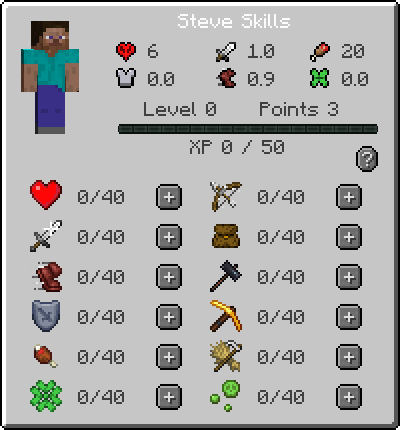

# Getting Started Guide

**Welcome to Valhelsia: Enhanced Vanilla!** Right away you're going to notice a few differences (besides the amazing shaders, textures, and landscape!)&#x20;

### Introduction

First, you have only 6 health (three hearts). That makes you an easy target for mobs, so get yourself to a safe spot and prepared for the first night, which can be difficult without a bed!

The most important thing to know right at the start is that Valhelsia: Enhanced Vanilla has an RPG-like (role playing game) leveling system which uses blue XP to progress through Levels giving you points to spend on skills. You start at Level zero and can actually do very little except use some wooden tools, break trees to get logs and dig dirt!&#x20;

You advance in levels by gaining blue XP (experience points). As you gain XP, you get Points that you can apply to level up individual skills like strength, mining, farming, and defense.

Hit the **K** key (by default) to view the interface showing you your levels, available points, and skills.&#x20;

You start the game with three free points. You will be able to spend them to have more life, equip a leather armor, unlock the use of furnace, and many other things...

As you gain Points, spend them wisely! Health and Defense will help you survive hostile nights. You'll need to progress in Mining and Farming to use any tools beyond wood, and to mine just about any source.&#x20;

For example, you cannot mine stone until Mining level 3 and you cannot use a stone tool until Mining level 4! Axe and Furnace Use are in the Farming skills. It's pretty dangerous in the caves though to go mining, so should you build up defense and strength?

Decisions...Decisions...

### How to Gain XP and Levels

The blue XP in your Skills page is the same as Minecraft XP. When you get 50 blue XP, you gain a skill level and the XP bar resets. In Minecraft, you generally get 1-5 XP for various activities like killing mobs, mining some ores, and even smelting.&#x20;


The XP bar and levels will not correspond to Minecraft levels as progressing in minecraft levels is exponential. You lose Minecraft experience levels when you die, but not your Valhelsia levels. You will however lose any progress toward the next Skill Level. Just don't die.&#x20;


The Minecraft level number will turn from green to blue when you have Valhelsia points to spend on skills.

### How to Gain Skill Points and Use Them

You get a point every time you reach 50 blue XP and level up. When you gain a Skill Point, you can use it by clicking the  button next to the skill. Once you spend a skill point, you cannot remove it! Choose carefully. By obtaining certain advancements, you will be rewarded points in relevant skills, or unallocated skill points to spend freely however you wish. You can find the full list of advancement rewards [here](knowledge-base.md#advancement).

### Your Stats

The stats at the top of the page reflect the current values for your Health, Attack Damage, Hunger, Armor, Speed, and Luck. These values will change depending on your current (not your maximum) health, hunger, equipment and other effects that may increase or decrease your values. For example, if you're holding a sword, your attack damage will reflect the sword's attack damage.&#x20;

In this image, I have 5 (out of 6) health, 16 (out of 20) hunger. I'm level 4 and have 9 skill points to spend.&#x20;

### Skills and Viewing the Skill Info

Click each skill icon to view the skill info for that skill. At the top is any general increase you gain from each level and the numbered list reflects the level you must achieve to unlock that activity.

### Viewing the Mining Sources (what you can mine at what level)

Click the small button in the upper right of the Mining Skill Info window to toggle the view to the Mining sources. These indicate which blocks you can mine at which level. Tool restrictions still apply. If you don't have the level required to mine the block, you can still break it but there is no drop.

### Additional Features

**Valhelsia: Enhanced Vanilla** is a modpack with many mods that bring new features to the game.&#x20;

The **M** key brings up the world map, showing everything that you've explored so far in the current dimension.

Look at REI (Roughly Enough Items), found to the right of your inventory, to view the items added to the game and how to make them. You can press **R** while your mouse is over an item to see how to craft it, and **U** to see uses for it. There's a lot of things to do beyond Vanilla minecraft!

### Multiplayer

If you're playing with friends, you can collaborate and each advance different skills. A miner paired with a farmer can allow each to spend some points increasing weapons and armor earlier in the game!

### Where to go from here?&#x20;

When you start out, you're a one-shot to most mobs! So get yourself a simple house (or a hole in the ground) and a bed as soon as you can.&#x20;

Then look through the different skills to determine your Skills path and get playing and collecting XP. You'll quickly get a feel for how much XP you get from the different activities like killing passive mobs vs hostile mobs.

_Stay safe friend. GLHF!_

