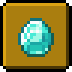
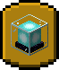
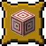
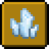
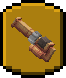

# Knowledge Base

## <mark style="color:orange;">Advancement</mark>

In Valhelsia: Enhanced Vanilla, you have several ways to progress in skills, the most popular method being to create XP farms. Now, added with the 1.1.0 update, you can also earn skill points by completing advancements! More difficult advancements will have greater rewards, to give you an incentive to seek out more challenging content.


For those who wish to progress faster, you can activate an alternative reward system by typing this command into chat:`!vconfig simple_advancement_points true`. This will give you 1 skill point for a task advancement, 2 skill points for a goal advancement and 3 skill points for a challenge advancement. You can also optionally disable the advanced reward system using`!vconfig individual_advancement_points false`. Config commands can only be used with cheats enabled or by an op on a server. Alternatively, the `vev_config.json` file can be edited directly.


### Story

<table><thead><tr><th width="261.70087626221806">Name</th><th width="264.3379170572548">Description</th><th>Reward</th></tr></thead><tbody><tr><td> Acquire Hardware</td><td>Smelt an iron ingot</td><td>+1 smithing</td></tr><tr><td> Not Today, Thank You</td><td>Deflect a projectile with a shield</td><td>+1 defense</td></tr><tr><td> Diamonds!</td><td>Acquire diamonds</td><td>+1 mining</td></tr><tr><td> Eye Spy</td><td>Follow an Eye of Ender</td><td>+1 agility</td></tr><tr><td> Zombie Doctor</td><td>Weaken and then cure Zombie Villager</td><td>+1 alchemy</td></tr></tbody></table>

### Nether

<table><thead><tr><th width="261.70087626221806">Name</th><th width="264.3379170572548">Description</th><th>Reward</th></tr></thead><tbody><tr><td> Return to Sender</td><td>Destroy a Ghast with a fireball</td><td>+2 archery</td></tr><tr><td> Subspace Bubble</td><td>Use the Nether to travel 7 km in the Overworld</td><td>+2 agility</td></tr><tr><td> Oh Shiny</td><td>Distract Piglins with gold</td><td>+1 trade</td></tr><tr><td> Hidden in the Depths</td><td>Obtain Ancient Debris</td><td>+1 mining</td></tr><tr><td> Hot Tourist Destinations</td><td>Explore all Nether biomes</td><td>+3 agility</td></tr><tr><td> Uneasy Alliance</td><td>Rescue a Ghast from the Nether, bring it safely home to the Overworld... and then kill it</td><td>+3 skill points</td></tr><tr><td> A Furious Cocktail</td><td>Have every potion effect applied at the same time</td><td>+3 alchemy</td></tr><tr><td> Withering Heights</td><td>Summon the Wither</td><td>+1 skill point</td></tr><tr><td> Beaconator</td><td>Bring a beacon to full power</td><td>+3 skill points</td></tr><tr><td> How Did We Get Here?</td><td>Have every effect applied at the same time</td><td>+75 skill points</td></tr></tbody></table>

### The End

<table><thead><tr><th width="261.70087626221806">Name</th><th width="264.3379170572548">Description</th><th>Reward</th></tr></thead><tbody><tr><td> Free the End</td><td>Good luck</td><td>+5 skill points</td></tr><tr><td> Great View From Up Here</td><td>Levitate up 50 blocks from the attacks of a Shulker</td><td>+2 agility</td></tr></tbody></table>

### Adventure 

<table><thead><tr><th width="261.70087626221806">Name</th><th width="264.3379170572548">Description</th><th>Reward</th></tr></thead><tbody><tr><td> Monster Hunter</td><td>Kill any hostile monster</td><td>+1 strength</td></tr><tr><td> Caves &#x26; Cliffs</td><td>Free fall from the top of the world (build limit) to the bottom of the world and survive</td><td>+2 skill points</td></tr><tr><td> Postmortal</td><td>Use a Totem of Undying to cheat death</td><td>+5 health</td></tr><tr><td> Hero of the Village</td><td>Successfully defend a village from a raid</td><td>+3 trade</td></tr><tr><td> Sniper Duel</td><td>Kill a Skeleton from at least 50 meters away</td><td>+1 archery</td></tr><tr><td> Bullseye</td><td>Hit the bullseye of a Target block from at least 30 meters away</td><td>+2 archery</td></tr><tr><td> Monsters Hunted</td><td>Kill one of every hostile monster</td><td>+5 skill points</td></tr><tr><td> Unlimited Power!</td><td>Craft a Wand and collect all 8 Spell Books.</td><td>+3 luck</td></tr><tr><td> Amateur Archaeologist</td><td>Find an Artifact</td><td>+1 skill point</td></tr><tr><td> Chest Slayer</td><td>Kill a Mimic</td><td>+1 strength</td></tr></tbody></table>

### Husbandry 

<table><thead><tr><th width="261.70087626221806">Name</th><th width="264.3379170572548">Description</th><th>Reward</th></tr></thead><tbody><tr><td> Water it can</td><td>Obtain and use the Watering Can to fertilize your crops</td><td>+1 farming</td></tr><tr><td> A Balanced Diet</td><td>Eat everything that is edible, even if it's not good for you</td><td>+5 skill points</td></tr><tr><td> A Complete Catalogue</td><td>Tame all cat variants!</td><td>+3 skill points</td></tr><tr><td> Two by Two</td><td>Breed all the animals!</td><td>+3 farming</td></tr><tr><td> Cutie Patootie</td><td>Tame an elephant with some peanuts</td><td>+2 skill points</td></tr></tbody></table>

### Farmer's Delight 

<table><thead><tr><th width="261.70087626221806">Name</th><th width="264.3379170572548">Description</th><th>Reward</th></tr></thead><tbody><tr><td> A Cup of Happiness</td><td>Clear away a harmful effect by drinking a bottle of Hot Cocoa</td><td>+1 stamina</td></tr><tr><td> Crop Rotation</td><td>Cultivate every fruit, vegetable, fungus or root you can find!</td><td>+3 farming</td></tr><tr><td> Master Chef</td><td>Eat a course of every meal available!</td><td>+5 skill points</td></tr></tbody></table>

### Artifality 

<table><thead><tr><th width="261.70087626221806">Name</th><th width="264.3379170572548">Description</th><th>Reward</th></tr></thead><tbody><tr><td> What's this?</td><td>Find your first Artifact</td><td>+1 luck</td></tr><tr><td> Give me all the shinies!</td><td>Why are you so obsessed with these again?</td><td>+1 mining</td></tr><tr><td> Nature Magician</td><td>Obtain all of the Nature Staffs</td><td>+1 luck</td></tr><tr><td> Collector's edition</td><td>Get 'em all!</td><td>+2 skill points</td></tr></tbody></table>

### ~~Applied Energistics~~ 

<table><thead><tr><th width="261.70087626221806">Name</th><th width="264.3379170572548">Description</th><th>Reward</th></tr></thead><tbody><tr><td> Shocking</td><td><del>C</del>harge Quartz with a Charger</td><td>+1 mining</td></tr></tbody></table>

### Better Dungeons 

<table><thead><tr><th width="261.70087626221806">Name</th><th width="264.3379170572548">Description</th><th>Reward</th></tr></thead><tbody><tr><td> Professional Dungeoneer</td><td>Explore all of the Better Dungeons</td><td>+2 agility</td></tr></tbody></table>

### Tech Reborn 

<table><thead><tr><th width="261.70087626221806">Name</th><th width="264.3379170572548">Description</th><th>Reward</th></tr></thead><tbody><tr><td> Refined Iron</td><td>Smelt an iron ingot in a furnace to refine impurities out of it</td><td>+1 smithing</td></tr></tbody></table>

### Create

<table><thead><tr><th width="261.70087626221806">Name</th><th width="264.3379170572548">Description</th><th>Reward</th></tr></thead><tbody><tr><td> Alliterations Aplenty</td><td>Create's materials have weird names, Andesite Alloy is one of them</td><td>+1 mining</td></tr><tr><td> Tasteful Power</td><td>Run a Water Wheel with Molten Chocolate</td><td>+2 stamina</td></tr><tr><td> Global Brewery</td><td>Watch a Spout fill a Bottle with potion fluid</td><td>+2 alchemy</td></tr><tr><td> Fwoomp! </td><td>Defeat an ennemy with your Potato Cannon</td><td>+2 points</td></tr><tr><td> The Brass Age</td><td>Use newly obtained Brass and some Wood to create a more advanced Casing.</td><td>+1 point</td></tr></tbody></table>

## <mark style="color:orange;">Enchanting</mark> 

Enchanting in Valhelsia: Enhanced Vanilla differs slightly from regular Minecraft. To be able to enchant your gear, you will first need to have the Alchemy skill at level 5+ to unlock the first tier of enchanting.

To unlock tiers 2 and 3, you will need to have the alchemy at level 10 and 18, respectively. If you want to extract the enchantment from a piece of equipment, you will need the Infusion Table, unlockable at Alchemy level 15.

To use the Infusion Table, you must place a book on it and then enchanted item. To start the extraction process, use a Flint and Steel on it and watch the show!
