# Changelog

##  <mark style="color:orange;">1.20.1</mark> 

### **1.1.2 - Minor Update**

#### **Patch Notes:**&#x20;

* Removed the torch block mixins (making torches water-resistant).

### **1.1.1 - Bugfix Update**

#### **Patch Notes:**&#x20;

* Removed Mossy Skeleton (not implemented) causing spam in the logs.

***

### **1.1.0 - Release**

#### **Patch Notes:**&#x20;

* Initial release for 1.12.1

##  <mark style="color:orange;">1.19.4</mark> 

### **1.1.1 - Sound Update**

#### **Patch Notes:**&#x20;

* Dungeon Door now has an opening and closing sound.



* Opening or closing a Dungeon Door now causes a game event to be fired (can now be detected by Sculk Sensors).

### **1.1.0 - Release**

#### **Patch Notes:**&#x20;

* Initial release for 1.19.4.

## ​ <mark style="color:orange;">1.19.3</mark> 

### **1.1.0 - Update**

#### **Patch Notes:**&#x20;

* Valhelsia Structures no longer requires Valhelsia Furniture as a dependency.
* Desert House is now generated only in the sandy deserts.
* Added Lapidified Post and Bundled Lapidified Posts.
* Added Mangrove Post and Bundled Mangrove Posts.
* Fixed the flame shade of brazier.

### **1.0.1 - Bugfix Update**

#### **Patch Notes:**&#x20;

* Now compatible with the latest versions of Forge.

### **1.0.0 - Release**

#### **Patch Notes:**&#x20;

* Initial release for 1.19.3.

## ​ <mark style="color:orange;">1.19.2</mark> 

### **1.0.3 - Sound Update**

#### **Patch Notes:**&#x20;

* Dungeon Door now has an opening and closing sound.



* Opening or closing a Dungeon Door now causes a game event to be fired (can now be detected by Sculk Sensors).

### **1.0.2 - Bugfix Update**

#### **Patch Notes:**&#x20;

* Now compatible with the 43.2.6 version of Forge.

### **1.0.1 - Bugfix Update**

#### **Patch Notes:**&#x20;

* Added missing mineable block tags.
* The bees now appear in the different hives of the structures.

### **1.0.0 - Release Update**

#### **Patch Notes:**&#x20;

* Valhelsia Structures is now fully integrated with [Valhelsia Furniture](https://www.curseforge.com/minecraft/mc-mods/valhelsia-furniture).

<figure>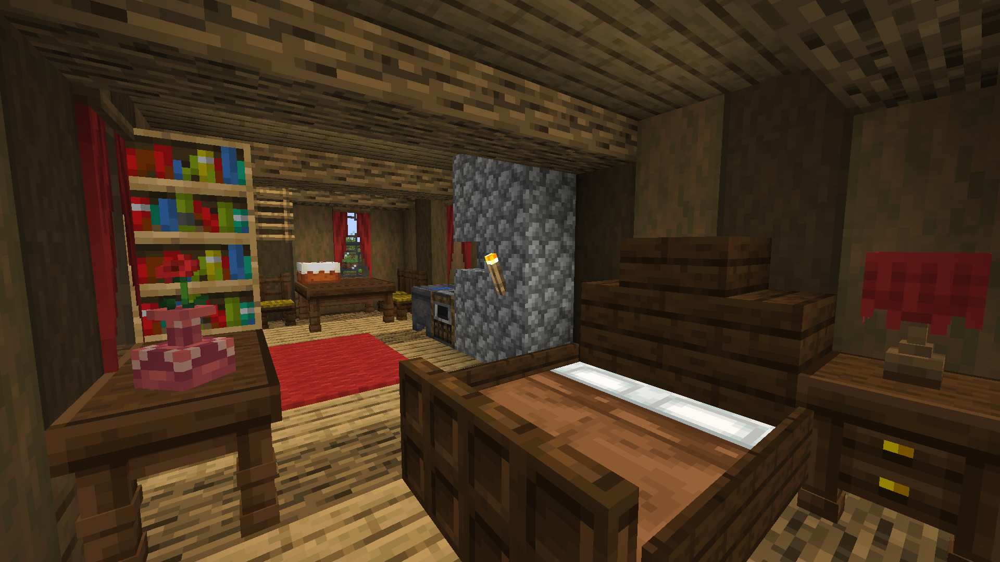<figcaption>
Some furniture naturally generated inside the forge.
</figcaption></figure>

* Added a new type of block, the Bundled Posts available in all wood variants and stripped.
* We have been working on the redesign of some structures including the player house and the spawner dungeon. The spawner dungeon is now generated with a new entrance coming directly to the surface.

<figure>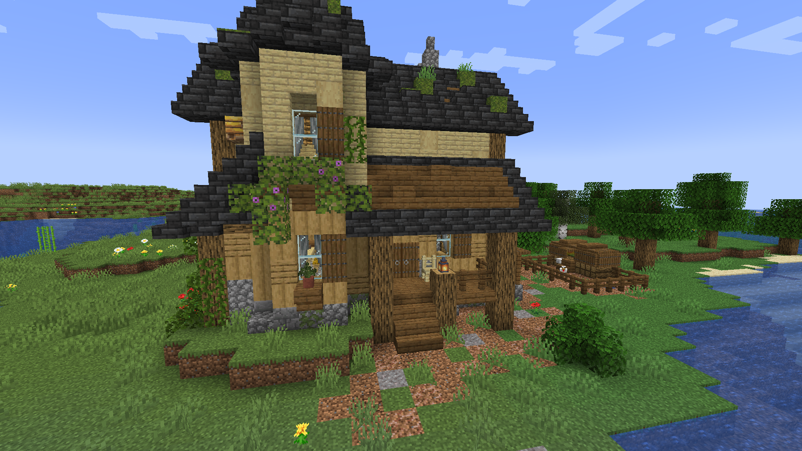<figcaption>
A chicken coop generated with this house. The structure is now built with new block types, the Bundle Post.
</figcaption></figure>

 

<figure>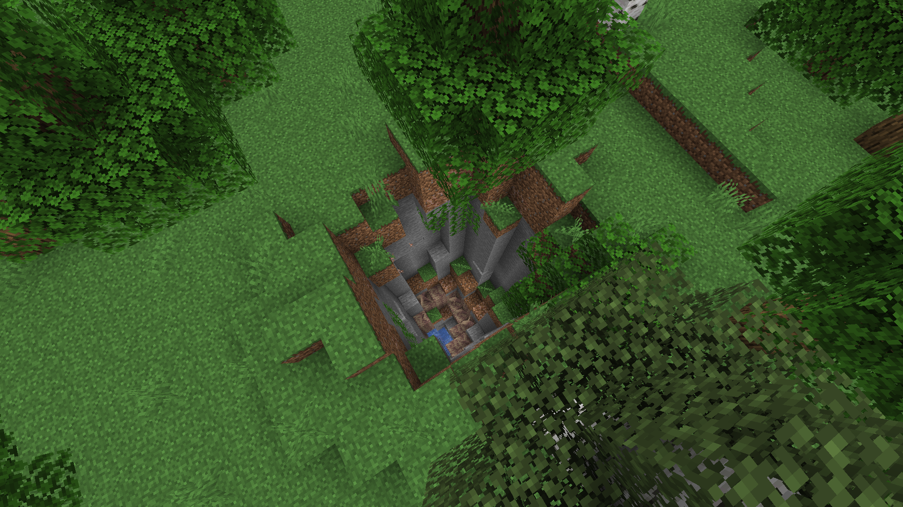<figcaption>
Be careful where you step!
</figcaption></figure>

 

<figure>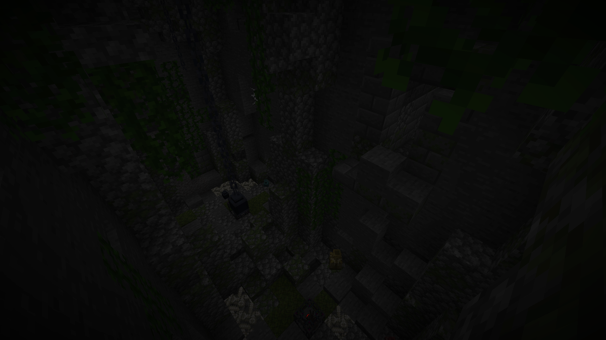<figcaption></figcaption></figure>

* New environments for certain structures, which integrate more naturally into the surrounding environment.
* During our last major update, we reworked the vanilla swamp hut to bring you our own version. Today, it's the spawner room's turn. The vanilla spawner room will no longer generate and is fully replaced.

<figure>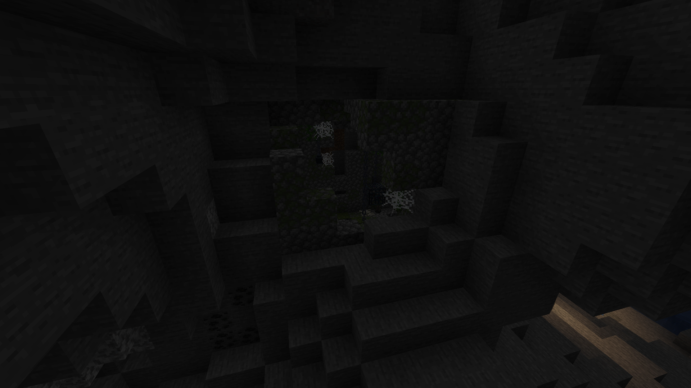<figcaption></figcaption></figure>

 

<figure>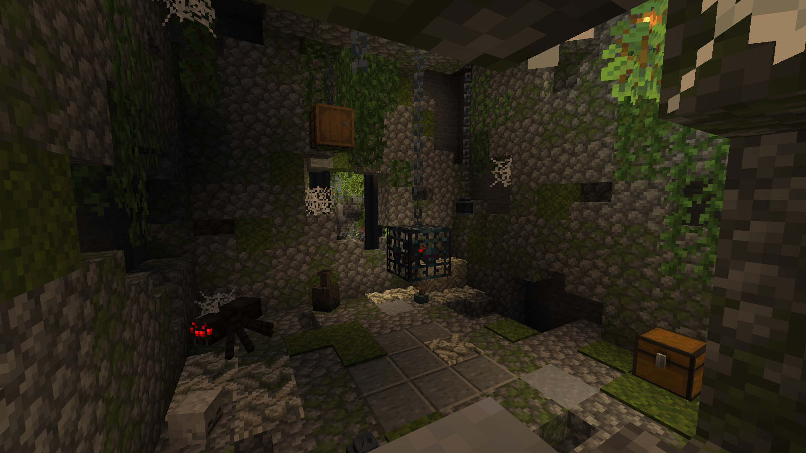<figcaption></figcaption></figure>

* Added the sleeping bag, it can be with the tent or separately. It allows you to sleep through the night without setting your respawn point. The sleeping bag are available in every dye color.
* Added the tent, available in every dye color.

<figure><figcaption>
Castle ruin with tents and sleeping bags, perfect to spend a good night accompanied.
</figcaption></figure>

* Added a new variant for the witch hut and the forge.

<figure>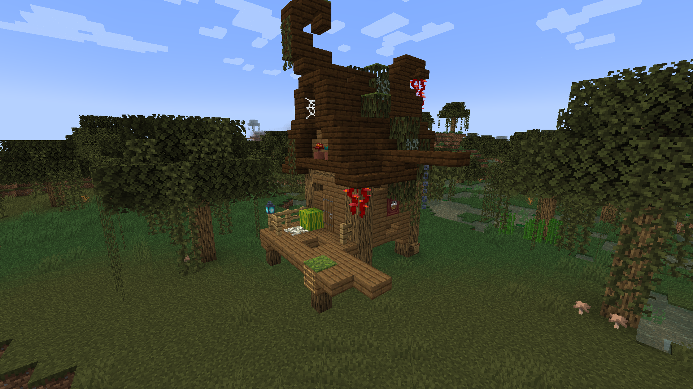<figcaption>
The witch hut has been slightly improved to add some new blocks from 1.19.
</figcaption></figure>

 

<figure>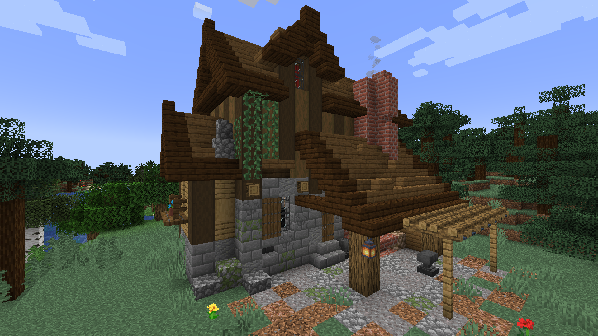<figcaption></figcaption></figure>

* Some parts of the castle have been reworked.

<figure>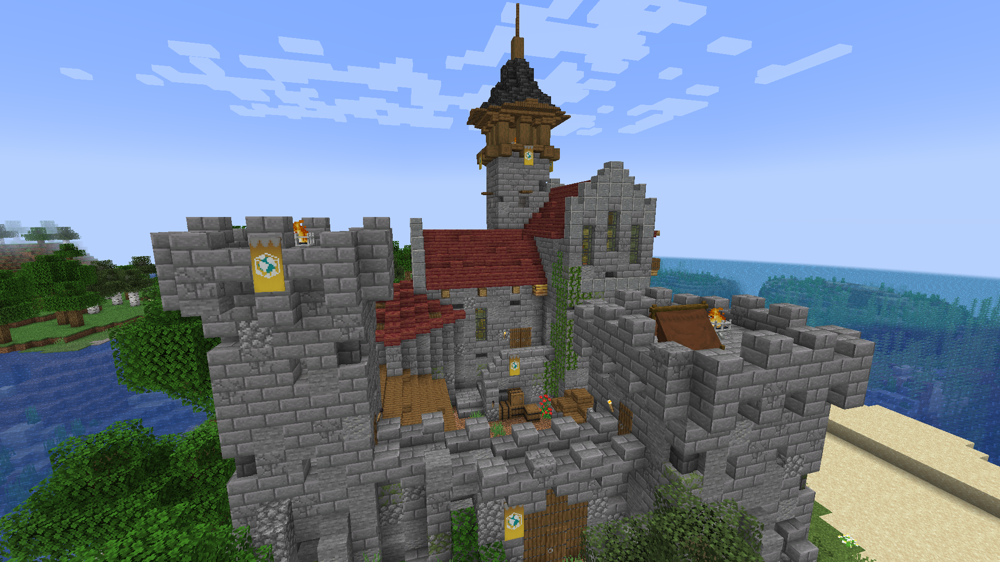<figcaption></figcaption></figure>

 

<figure>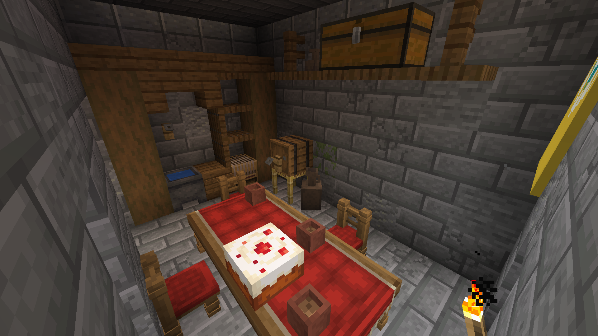<figcaption></figcaption></figure>

* The Metal Framed Glass has a new texture and now available in every dye color.
* Added a leg processor for the witch hut so that the structure generates correctly according to its environment.
* Improvement of some loot table.

## ​ <mark style="color:orange;">1.18.2</mark> 

### **0.1.0 - Release**

#### **Patch Notes:**&#x20;

* Initial release for 1.18.2.
* Slightly increased spawn rate of all structures.
* Removed biome blacklist/whitelist from the config file.


Every structure now has a tag that defines the biomes it can generate in\
(valhelsia\_structures/tags/worldgen/biome/has\_structure/\<name>.json).


* Added new min\_structure\_distance config value, that can be used to change the distance that needs to at least be between two structures.

## 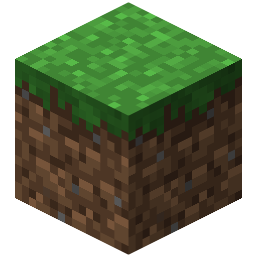 1.18.1

### **0.1.1 - Bugfix Update**

#### **Patch Notes:**&#x20;

* Fixed crash on recent forge versions [#119](https://github.com/ValhelsiaTeam/Valhelsia-Structures/issues/119).
* Fixed Dungeon Door shape [#125](https://github.com/ValhelsiaTeam/Valhelsia-Structures/issues/125).
* Witch and cat now spawn again in the Witch Hut structure.
* Added config option to disable Doused Torch (from the 1.16 version).

### **0.1.0 - Release**

#### **Patch Notes:**&#x20;

* Initial release for 1.18.1.

##  1.17.1

### **0.1.1 - Bugfix Update**

#### **Patch Notes:**&#x20;

* Fixed the OptiFine incompatibility [#109](https://github.com/ValhelsiaTeam/Valhelsia-Structures/issues/109).
* The Dungeon Door now drops after breaking a block below it [#107](https://github.com/ValhelsiaTeam/Valhelsia-Structures/issues/107).
* Fixed the generation value in height for the Spawner Dungeon where it was too high.
* The structures are no longer generated on the rivers.

### **0.1.0 - Release**

#### **Patch Notes:**&#x20;

* Initial release for 1.17.
* Completely translated into French & Norwegian and partly into Polish, German, Spanish and Ukrainian, thanks to the translators.

##  1.16.5

### **0.1.6 - Bugfix Update**

#### **Patch Notes:**&#x20;

* Some improvements on the spawn rate of the structures.

### **0.1.5 - Bugfix Update**

#### **Patch Notes:**&#x20;

* The Cartographer now trades maps pointing to castles and dungeons from Valhelsia Structures.
* Dimensions can now be blacklisted entirely, not just biomes (thanks wchen1990).
* Fixed an incompatibility with Bamboo Blocks (and potentially other mods).
* Structures are now correctly centered.
* Fixed a rendering issue with the Dungeon Door.
* The Dungeon Door should now open correctly on servers.
* Fixed an issue where the Spawner Dungeon size was out of the valid range.


Requires [**Valhelsia Core 16.0.10**](https://www.curseforge.com/minecraft/mc-mods/valhelsia-core/files/3431330).


### **0.1.4 - Bugfix Update**

#### **Patch Notes:**&#x20;

* Fixed a potential crash ([Issue #88](https://github.com/ValhelsiaTeam/Valhelsia-Structures/issues/88)).
* Improved the water detection below certain structures (structures shouldn't generate over lakes anymore).
* Fixed the custom Dirt, Coarse Dirt, and Grass Blocks around structures breaking slowly regardless of tool used.
* Removed remaining code for structures that no longer exist due to being renamed.
* Updated the Forge structure.

### **0.1.3 - Bugfix Update**

#### **Patch Notes:**&#x20;

* Fixed "Missing Structure Start" log spam.
* Fixed Big Jars overwriting other blocks.
* Fixed crash when other features overlap dungeon doors during world generation.
* Added wildcard support to biome blacklisting - you can now add an asterisk before or after text in the blacklist entries, such as "twilightforest\*" (which would prevent structures generating in any Twilight Forest biomes).
* Structures will no longer spawn in water, even if it is a valid biome - this prevents structures appearing in the middle of lakes, for example.

### **0.1.2 - Bugfix Update**

#### **Patch Notes:**&#x20;

* Fix Mixin log spam on server (and possible crash).
* Improve structure registration and placement checks (structures should generare more often now).
* Pillagers with swords will now attack you.
* Small aesthetic correction on the Forge structure.
* Structures should now better match their surrounding land.

### 0.1.1 - **Bugfix Update**

#### **Patch Notes:**&#x20;

* Add Big Jar Top Block.
* Change Zombie Special Spawner to Drowned Special Spawner in the flooded main room of the Spawner Dungeon.
* Fix Pillagers spawning without crossbow.
* Fix an air block underwater in the flooded main room of the Spawner Dungeon.

### **0.1.0 - The Witch Hut Update**

The first Valhelsia Structures update of 2021 is now available, take a look at our blog post to see what's new!

:link: Read more: [https://valhelsia.net/blog/valhelsia-structures-patch-0-1-0-the-witch-hut/](https://valhelsia.net/blog/valhelsia-structures-patch-0-1-0-the-witch-hut/2)&#x20;
