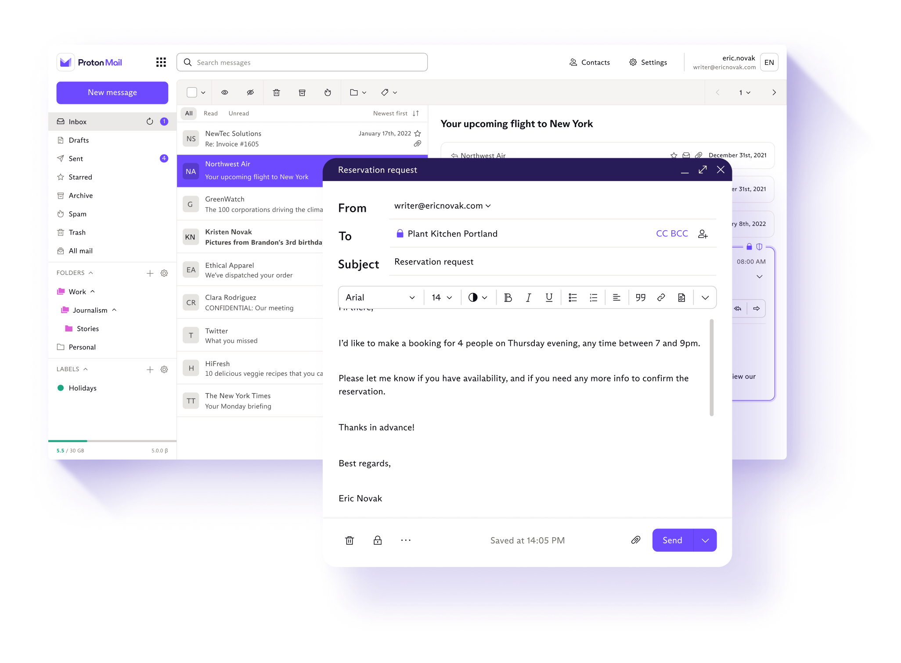
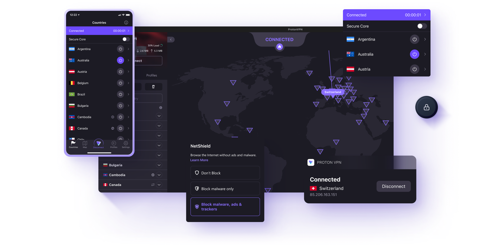

# Support Us

## <mark style="color:orange;">Introduction</mark>

Players have been asking for a while if we accept donations. While we truly appreciate the interest, our current approach is to provide recognition back to the people who support us financially. Consequently, at this moment, we do not have a direct donation option available but several options are on the table.

However, there are alternative ways for you to support us. We've partnered with serious companies to bring you products that may be of interest. The revenue received from our partners will go towards allowing us to continue the ongoing development of Valhelsia projects, and we greatly appreciate this indirect support received.

### Our Partners

<table data-card-size="large" data-column-title-hidden data-view="cards"><thead><tr><th data-card-target data-type="content-ref"></th><th data-hidden data-card-cover data-type="files"></th></tr></thead><tbody><tr><td><a href="https://bisecthosting.valhelsia.net">https://bisecthosting.valhelsia.net</a></td><td><a href=".gitbook/assets/BisectHosting.jpg">BisectHosting.jpg</a></td></tr><tr><td><a href="https://proton.valhelsia.net">https://proton.valhelsia.net</a></td><td><a href=".gitbook/assets/proton-og.png">proton-og.png</a></td></tr></tbody></table>

#### BisectHosting

Want to play our modpacks with your friends? [BisectHosting](https://bisecthosting.valhelsia.net) offers quick, simple and high quality server hosting with over a dozen locations available across the world, ensuring low latency. After your purchase, the server is already configured and ready to use.

Using the promo code "**Valhelsia**" to save **25%** off your first month as a new client for any of their gaming servers.


Link to their website.


#### Proton

We are proud to partner with [Proton](https://proton.valhelsia.net) to offer you encrypted and user-friendly services for email, calendar, file storage, VPN, all designed with one principle in mind: your data, your rules. Feel free to explore, as there is a free version available for each of their products!


Link to their website.


<figure><figcaption></figcaption></figure>

 

<figure><figcaption></figcaption></figure>

***

### Free support

You can also help us to translate our mods and modpacks, find more information on the [page](navigation/translation.md) dedicated to this subject.

Finally, for those who can't spare the money, there are non-financial ways to support us too - things such as streaming our packs, creating videos, or sharing screenshots; playing with friends; or being active on our Discord server all help us, and we appreciate you all greatly.
